# Manual de uso de ytstudio

<!-- MANUAL_VERSION: 0.67.0 -->
<!-- PLANTILLA: nueva -->

Este manual está escrito para **cualquier persona**, sin conocimientos
técnicos. Si sabes usar el navegador y arrastrar un archivo, sabes usar este
programa.

> 🎨 **Estás leyendo el manual de la plantilla NUEVA** (la interfaz clara u
> oscura, con las pestañas Corrida · Material · Concepto · Guion · Escenas ·
> Personajes · Metadatos · Shorts). Si cambias a la plantilla clásica en
> **Ajustes**, este mismo menú te mostrará el manual de la otra, con sus
> propias capturas. Ver el capítulo 2.6.

**Cómo leerlo:**

- ¿Es tu primera vez? Lee los capítulos **1, 2 y 3** y haz tu primer video.
- ¿Quieres hacer un tipo concreto de video (un Short, un anuncio, un video
  con tu cara)? Ve directo al capítulo **4**.
- ¿Buscas algo puntual («cómo cambio la miniatura», «por qué salió caro»)?
  Usa el **buscador** del manual dentro del programa (**📖 Manual de uso** →
  🔎) o el índice lateral.

> **La regla de oro:** todo lo que cuesta dinero se te avisa **antes** (con
> una estimación), se mide **mientras** (con un tope automático que frena el
> gasto) y se registra **después** (con el gasto real de la corrida). Nunca
> hay una sorpresa silenciosa.

> **Segunda regla de oro:** el momento de corregir es **antes de generar las
> imágenes**. Ahí todo es gratis. Después, corregir cuesta volver a generar.

---

## 1. Qué hace este programa (y qué no hace)

ytstudio toma **tu idea o tu voz grabada** y devuelve un **video terminado
para YouTube y redes sociales**: guion, escenas, imágenes, voz, música,
sonido ambiente, subtítulos, montaje, miniatura (la imagen de portada) y los
textos para publicar.

### 1.1 Lo que sí hace

| Puede… | Detalle |
|---|---|
| Partir de casi cualquier cosa | Una idea de una línea, un guion completo, tu voz grabada, una foto, un video, o un enlace de YouTube que quieras imitar |
| Respetar tu voz palabra por palabra | Si subes tu grabación, esa es la voz del video: no se sustituye por una voz artificial |
| Crear las imágenes | Genera con inteligencia artificial la imagen (o el clip de video) de cada escena, siempre con el mismo estilo visual |
| Usar TU material | Tus fotos, tus videos, tu música y tus efectos entran en el montaje con prioridad sobre lo generado |
| Poner texto en pantalla | Rótulos (los letreros con el nombre, la fecha o el dato), subtítulos sincronizados y tarjetas informativas |
| Sonar bien | Música por tramos, ambiente (viento, multitud, lluvia), efectos en los cortes y mezcla con el volumen estándar de YouTube |
| Continuar donde se quedó | Si lo detienes, lo retomas sin volver a pagar lo ya hecho |
| Trabajar en 10 idiomas | Español, inglés, chino, hindi, francés, árabe, bengalí, portugués, ruso y alemán |

### 1.2 Lo que no hace

- **No publica solo** (salvo que lo actives a propósito): prepara el paquete
  final y tú lo subes. Ver el capítulo 8.
- **No garantiza que los datos sean ciertos.** El guion lo escribes tú o lo
  escribe la inteligencia artificial: **verificar los hechos es tu
  responsabilidad**.
- **No genera caras de personas reales** con IA (los generadores lo
  rechazan). Para eso está el **banco de elementos**: fotos reales que tú
  aportas (capítulo 5.5).
- **No funciona sin ffmpeg**, un programa gratuito que hace el montaje. Se
  instala una sola vez (capítulo 2.3).

### 1.3 El recorrido completo, en una imagen

```
TÚ APORTAS                    EL PROGRAMA HACE                   TÚ RECIBES
─────────────                 ────────────────────               ──────────
idea escrita        →   1 Análisis      lee tu material
guion               →   2 Concepto      define el estilo
tu voz grabada      →   3 Guion         escribe o adopta el tuyo
tus fotos/videos    →   4 Escenas   ◄── PUNTO DE CONTROL (gratis)
enlace de ejemplo   →   5 Voz           monta la pista de voz
                        6 Imágenes  ◄── aquí está casi todo el gasto
                        7 Música        banda sonora y ambiente
                        8 Subtítulos    sincronizados a la voz real
                        9 Montaje       une, anima y mezcla        →  video.mp4
                       10 Metadatos     3 títulos y 3 miniaturas   →  miniatura
                       11 Publicación   deja el paquete listo      →  textos
```

---

## 2. Instalación y primer arranque (una sola vez)

### 2.1 Abrir el programa

Doble clic en **`iniciar.bat`** (en Windows) o `./iniciar.sh` (Mac/Linux).

Ocurren dos cosas:

1. Se abre una **ventana negra** (la consola). **No la cierres**: es el motor
   del programa. Cerrarla apaga todo.
2. Se abre el navegador en la interfaz. Si no se abre solo, entra a
   **http://localhost:8765**.

Para cerrar el programa: cierra la ventana negra.

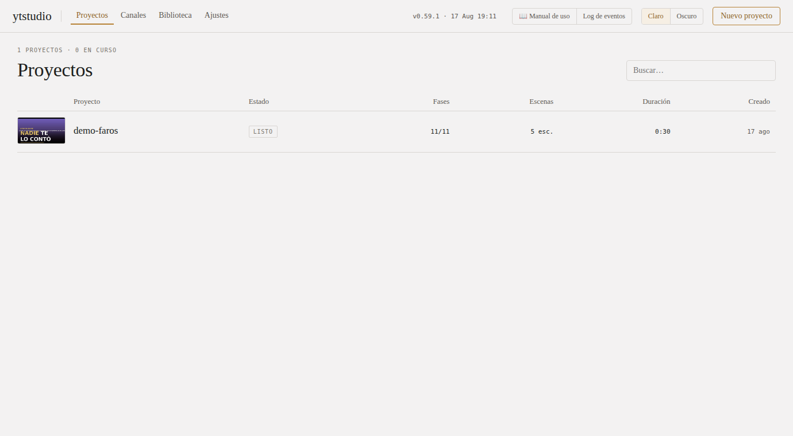

Arriba, en la cabecera, está todo lo que vas a usar:

| Control | Para qué |
|---|---|
| **Proyectos** | La lista de tus videos |
| **Canales** | La identidad guardada de cada canal (estilos reutilizables) |
| **Biblioteca** | El banco de elementos: tus fotos, mapas y logos |
| **Ajustes** | Plantilla, idioma, calidad, modelos, claves y ahorro |
| **La versión** (v0.60.0 · fecha) | Un clic muestra las novedades de cada versión |
| **📖 Manual de uso** | Este manual, con buscador |
| **Log de eventos** | El historial de todo lo que pasó (para diagnosticar) |
| **Claro / Oscuro** | El aspecto de la interfaz, a tu gusto |
| **Nuevo proyecto** | Empezar un video |

### 2.2 Las claves de API: la «llave» de cada servicio

Una **clave de API** es una contraseña larga que le das al programa para que
pueda usar un servicio de inteligencia artificial **en tu nombre y con tu
cuenta**. Se pega una vez y se queda guardada en tu equipo.

Ve a **Ajustes → Claves de API**, pega cada clave y pulsa **Guardar claves**.
La etiqueta «ok» confirma que quedó configurada; «falta», que no.

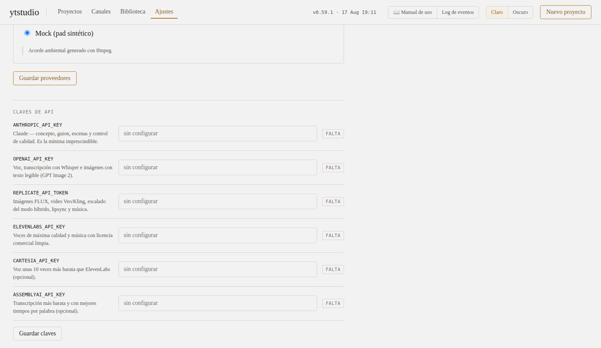

| Clave | Para qué sirve | ¿Es imprescindible? | Dónde se consigue |
|---|---|---|---|
| `ANTHROPIC_API_KEY` | Piensa el video: concepto, guion, escenas, dirección de arte, metadatos | **Sí.** Sin ella todo sale de ejemplo | console.anthropic.com → API Keys |
| `REPLICATE_API_TOKEN` | Crea las imágenes, los clips de video, el escalado, la música y el lipsync | Sí, para tener imágenes de verdad | replicate.com → API tokens |
| `OPENAI_API_KEY` | Transcribe tu voz (Whisper) y genera las imágenes donde se lee un texto | Sí, si narras tú | platform.openai.com → API keys |
| `ELEVENLABS_API_KEY` | Voces de máxima calidad y música con licencia comercial limpia | Opcional | elevenlabs.io → perfil |
| `CARTESIA_API_KEY` | Voz artificial mucho más barata que ElevenLabs | Opcional | cartesia.ai |
| `ASSEMBLYAI_API_KEY` | Transcripción más barata y con mejores tiempos por palabra | Opcional | assemblyai.com |

> ⚠ **Si falta una clave el programa no se rompe: cambia a «modo vista
> previa» y te avisa.** En ese modo las imágenes son de relleno y la voz es
> un silencio con la duración correcta. Sirve para aprender a usarlo sin
> gastar, pero **no publiques un video hecho así**.

### 2.3 ffmpeg: la única instalación obligatoria

ffmpeg es un programa gratuito que corta, une y mezcla video y audio. Es el
«taller de montaje». **Sin él, ytstudio no funciona.**

- **Windows:** descarga `ffmpeg-release-essentials.zip` de
  [gyan.dev](https://www.gyan.dev/ffmpeg/builds/) y descomprímelo en
  `C:\ffmpeg`, de modo que exista el archivo `C:\ffmpeg\bin\ffmpeg.exe`.
  No hace falta tocar nada más: el programa lo busca ahí solo.
- **Mac:** en la Terminal, `brew install ffmpeg`.
- **Linux:** `sudo apt install ffmpeg`.

### 2.4 Comprobar que todo está sano (gratis)

Doble clic en **`probar.bat`** (o `./probar.sh` en Mac/Linux). Ejecuta unas
60 baterías de comprobaciones internas en unos minutos.

- **No gasta un centavo**: no usa claves ni internet.
- **No toca tus proyectos**: trabaja en carpetas temporales.
- Termina diciendo **TODO EN VERDE** o exactamente qué falló y dónde.
- Si dice **VERDE PARCIAL — sin ffmpeg**, instálalo (punto 2.3): no se
  comprobaron ni la voz, ni el audio, ni el montaje.

Úsalo **después de cada actualización** y **antes de una generación cara**.

### 2.5 Actualizar el programa

| Archivo | Qué hace | Cuándo usarlo |
|---|---|---|
| **`pull.bat`** | Trae la última versión en segundos y te dice qué cambió | Siempre, es el normal |
| **`actualizar.bat`** | Lo mismo + reinstala las librerías (tarda más) | Solo si el aviso menciona que cambiaron las dependencias |

Después de actualizar, **cierra la ventana negra y vuelve a abrir
`iniciar.bat`**. En la cabecera verás la versión; haz clic para leer las
**novedades**.

Dos avisos que pueden aparecer ahí:

| Aviso | Qué significa | Qué hacer |
|---|---|---|
| **actualización NO aplicada: reinicia** | Bajaste la versión nueva pero el programa sigue corriendo la vieja | Cierra la ventana negra y abre `iniciar.bat` otra vez |
| **N archivo(s) del programa modificados** | Hay archivos del programa distintos a los originales (pasa el ratón para ver cuáles) | Si no los tocaste tú, la orden `git checkout .` los restaura. Mientras difieran, actualizar puede fallar |

> 💡 **Tu material propio nunca cuenta como «modificado»**: tu música, tus
> efectos, tus ambientes, tu banco de elementos y tus proyectos viven en tu
> equipo y el programa los ignora a propósito.

### 2.6 Las dos plantillas de la interfaz

El programa se puede ver de **dos maneras distintas**, y eliges cuál usar sin
perder la otra. Las dos hablan con el mismo motor y con los mismos proyectos:
cambiar de una a otra **no toca nada de tu trabajo**.

| Plantilla | Cómo se ve | Sus pestañas |
|---|---|---|
| **Nueva** (la de este manual) | Editorial, con modo claro y oscuro | Corrida · Material · Concepto · Guion · Escenas · Personajes · Metadatos · Shorts |
| **Clásica** | Oscura, la de las versiones anteriores | Guion · Storyboard · Editor · Video · Concepto · Archivos · Shorts |

**Para cambiar:** ve a **Ajustes → Plantilla de la interfaz**. Cada plantilla
se presenta en una **ficha con su miniatura**, su nombre y en qué se nota, para
que veas cómo es antes de probarla. Pulsa **«Usar esta plantilla»** en la que
quieras y aparece un **aviso de confirmación**: hasta que respondas **«Sí,
cambiar…»** no cambia nada. Entonces la página se recarga sola y el **manual
también cambia**, para que sus capturas coincidan con lo que tienes delante.

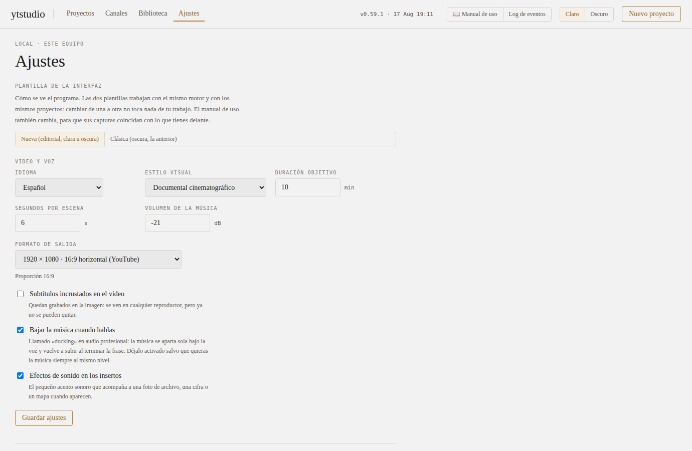

> 💡 **Un clic suelto ya no te cambia de interfaz.** Hasta la v0.61.0 eran dos
> botones pegados y bastaba con pulsar el otro por curiosidad para acabar en
> una interfaz distinta. Desde la v0.62.0 hay que elegir y confirmar; si te
> arrepientes, **Cancelar** deja todo como estaba.

**Las dos tienen los mismos controles.** Desde la v0.61.0 no hay ninguna
función que solo esté en una: la estimación de costo antes de generar, la
parada en el punto de control, la presencia del personaje, duplicar y borrar
proyectos, el arco musical y el resto están en las dos. Lo que cambia es
**cómo se distribuye en pantalla**:

| Diferencia | Nueva | Clásica |
|---|---|---|
| Modo claro y oscuro | Sí | No (siempre oscura) |
| La lista de proyectos | En su propia pantalla | Siempre a la vista, en la barra lateral |
| Material, personajes y escenas | En pantallas separadas | Todo en pestañas de un mismo panel |

> ✅ **Desde la v0.67.0 no falta nada en ninguna.** Durante unas versiones, la
> plantilla nueva se había dejado por el camino cuatro cosas del formulario de
> proyecto nuevo (subir archivos, los enlaces de referencia, la presencia del
> personaje y el canal), la ficha del concepto, las descargas de subtítulos y
> miniatura, el desglose del gasto por proveedor y el filtro de proyectos por
> estado. Están **todas** de vuelta.

> 💡 **Elige la que te resulte más cómoda de leer.** Son dos vistas del mismo
> programa y los proyectos son los mismos: puedes ir y volver tantas veces
> como quieras, incluso a mitad de un video.

---

### 2.7 Moverte por el programa: la ruta de navegación

Justo debajo del menú de arriba hay una línea fina que dice **dónde estás**.
Se llama *ruta de navegación* (o «migas de pan», porque va dejando el rastro
del camino que has hecho):

```
← Atrás    Proyectos  ›  Los fareros del siglo XIX  ›  Escenas
```

Se lee de izquierda a derecha, de lo general a lo concreto:

- **Cada tramo azul es un botón.** Pulsa **Proyectos** y vuelves a la lista;
  pulsa el nombre del video y vuelves a su corrida. Es la forma rápida de
  **subir un nivel** sin buscar el botón correcto.
- **El último tramo, en gris, es donde estás.** No se pulsa porque ya estás
  ahí.
- **← Atrás** deshace tu último salto, sea cual sea. Aparece en cuanto has
  dado al menos un paso dentro del programa.

**Y además funcionan los botones del navegador.** Cada pantalla tiene ahora su
propia dirección, así que:

| Lo que haces | Lo que pasa |
|---|---|
| Botón **←** del navegador (o `Alt`+`←`) | Vuelves a la pantalla anterior |
| Botón **→** del navegador | Avanzas otra vez |
| **F5** (recargar) | Te quedas **donde estabas**, no vuelves al principio |
| Guardar la página en marcadores | El marcador abre esa pantalla concreta |

> 💡 Si trabajas con dos videos a la vez, puedes abrir cada uno **en su propia
> pestaña del navegador** (clic con el botón derecho → «Abrir en una pestaña
> nueva» no funciona sobre los botones, pero sí puedes copiar la dirección de
> la barra y pegarla en otra pestaña). Las dos pestañas hablan con el mismo
> motor, así que ves lo mismo actualizado.

---

## 3. Tu primer video, paso a paso

Esta es una prueba completa que **cuesta centavos** y te enseña todo el
recorrido. Reserva 20 minutos.

**Paso 1 — Prepara el modo económico.** Ve a **Ajustes**:

- En **Video y voz → Duración objetivo**, pon **3 minutos**.
- Baja a **Proveedores y modelos → Imágenes IA** y elige **FLUX schnell**
  (unos $0.003 por imagen: un video entero de prueba cuesta menos que un
  café).
- En **Video generativo por escena**, elige **Ninguno — Ken Burns**
  (movimiento de cámara sobre las imágenes: gratis y queda muy bien).
- Pulsa **Guardar ajustes** y **Guardar proveedores**.

**Paso 2 — Crea el proyecto.** Botón **Nuevo proyecto** (arriba a la
derecha):

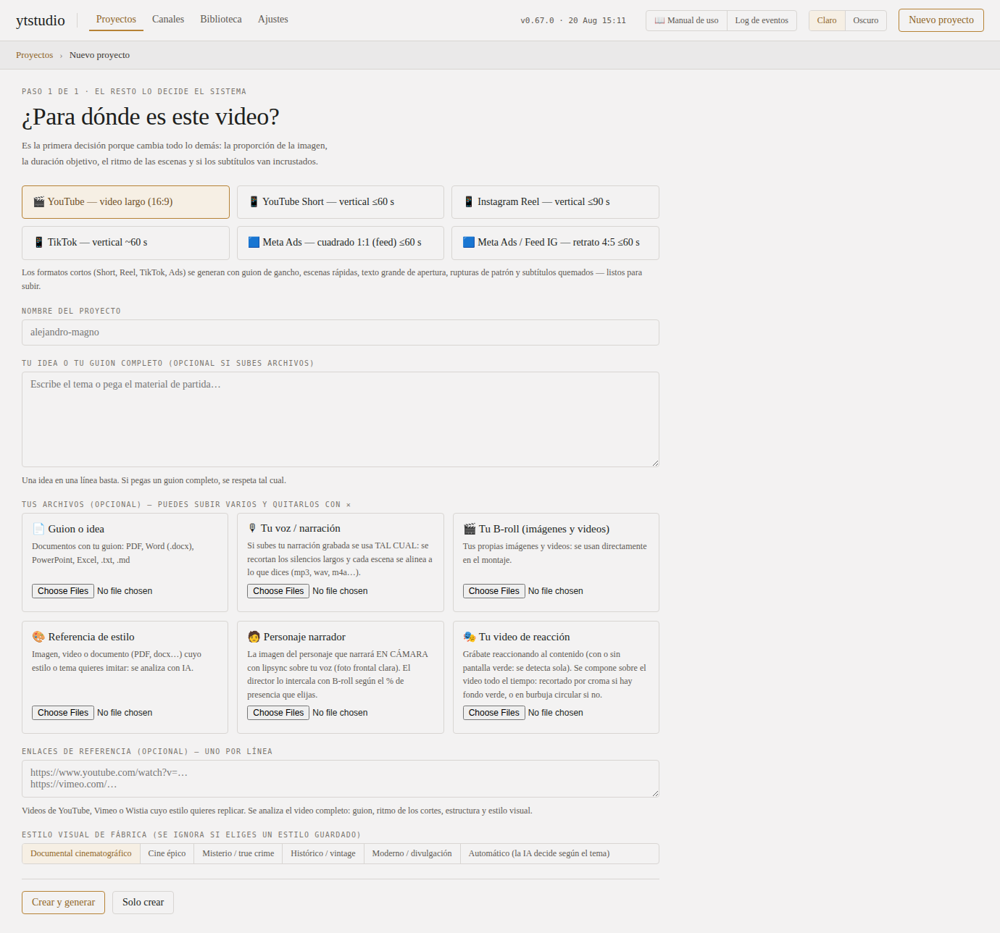

1. **¿Para dónde es este video?**: deja **YouTube — video largo (16:9)**.
2. **Nombre del proyecto**: algo corto y sin acentos, por ejemplo
   `prueba-faros`.
3. **Tu idea o tu guion completo**: escribe tu idea. Una o dos frases bastan:
   «Un documental sobre los fareros que salvaron miles de vidas en el siglo
   XIX: soledad, tormentas y la luz que nunca se apagó». Si ya tienes el
   guion escrito, pégalo entero y se respeta tal cual.
4. **Tus archivos** (opcional): si tu material ya existe —un PDF con el
   guion, tu narración grabada, tus fotos y videos, una imagen de referencia,
   la foto del personaje que narrará en cámara o tu video de reacción—
   súbelo aquí, cada cosa en su recuadro. **Si subes archivos no hace falta
   escribir nada**: el proyecto se puede crear solo con ellos. Puedes subir
   varios y quitar cualquiera con la **✕** que aparece a su lado.
5. **Enlaces de referencia** (opcional): pega, uno por línea, los videos de
   YouTube, Vimeo o Wistia cuyo estilo quieras replicar. El programa analiza
   el video completo: guion, ritmo de los cortes, estructura y estilo visual.
6. **Canal y estilo guardado** (opcional): si ya tienes canales creados
   (capítulo 5.5), elige el canal y el estilo. Así el video nace con la
   identidad de tu canal puesta y sin volver a pagar el análisis.
7. **Estilo visual de fábrica**: elige **Documental cinematográfico**. (Se
   ignora si elegiste un estilo guardado en el punto anterior.)
8. Pulsa **Solo crear** (para revisar antes de gastar) o **Crear y generar**
   (para lanzarlo entero de una vez).

> 🧑 **Si subes la foto del personaje narrador**, justo debajo aparece un
> ajuste extra: **cuánto sale en pantalla** (~15 %, ~30 %, ~45 % o ~60 %) y
> si quieres que salga **en burbuja** (un círculo sobre el B-roll, estilo
> reacción de TikTok). Ojo, que este es el ajuste que más manda en la
> factura: el lipsync se cobra **por segundo de personaje en pantalla**, y la
> estimación previa ya lo refleja.

> 💾 **No pierdas lo escrito.** Si a mitad de rellenar el formulario te das
> cuenta de que falta configurar algo y te vas a **Ajustes** o a **Canales**,
> vuelve tranquilo: lo que hubieras escrito sigue ahí, guardado solo en tu
> navegador. Verás un aviso que lo dice y un botón **Empezar de cero** por si
> prefieres el formulario en blanco. Lo único que hay que volver a elegir son
> los **archivos** (un video de 300 MB no cabe en la memoria del navegador).
> Al crear el proyecto, el borrador se descarta.

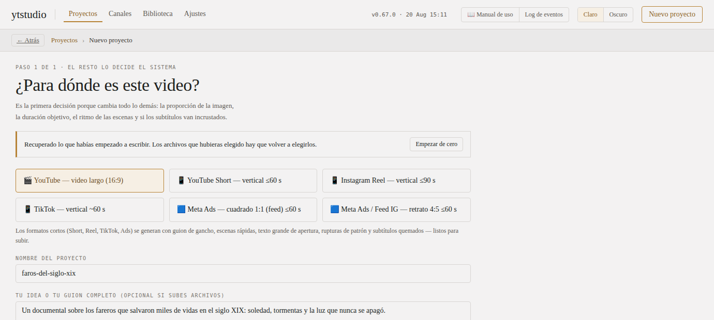

**Paso 3 — Mira lo que va a costar.** En la pestaña **Corrida**, la columna
de la derecha muestra **Estimado antes de generar**: la cifra aproximada y
el tiempo. Haz clic para desplegar el desglose por fases. Ese número es tu
presupuesto.

**Paso 4 — Genera solo hasta el guion gráfico.** Junto al botón **Generar
video** hay un desplegable: elige **Hasta el guion gráfico** y pulsa Generar.
En unos minutos tendrás concepto, guion y todas las escenas planificadas
**sin haber generado ninguna imagen**, que es lo que cuesta.

**Paso 5 — Mira cómo trabaja.** En **Corrida**: a la izquierda, las 11 fases
con su estado; en el centro, el video cuando exista; a la derecha,
**Atención** (lo que necesita tu decisión), el estimado y el **gasto real**.

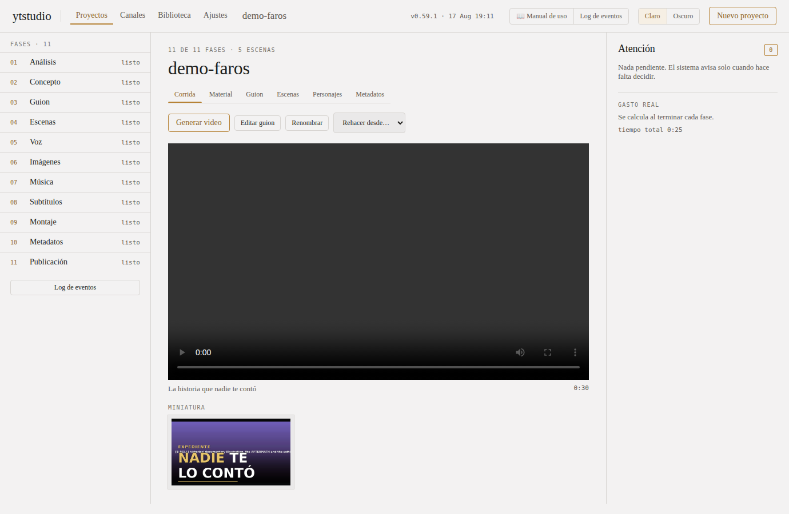

Puedes cerrar el navegador: **el trabajo sigue** en la ventana negra.

**Paso 6 — Revisa antes de gastar.** Entra a **Guion** para leerlo y
corregirlo, y a **Escenas** para ver qué se va a ilustrar en cada momento.
Aquí todo es gratis todavía.

**Paso 7 — Genera el video completo.** Vuelve a **Corrida**, pon el
desplegable en **Video completo** y pulsa **Generar video**. Ahora sí se
crean las imágenes, la voz, la música y el montaje. Puedes cerrar el
navegador: el trabajo sigue en la ventana negra.

**Paso 8 — Elige y descarga.** En **Metadatos** eliges entre 3 miniaturas, 3
títulos y 3 descripciones. En **Corrida** tienes el video para reproducirlo.

Ya está: ese es el ciclo completo. Todo lo demás en este manual es para
hacerlo **mejor** y **más barato**.

---

## 4. Elige el tipo de video: una receta para cada uno

Lo primero que eliges al crear un proyecto es **para dónde es el video**. Esa
elección cambia sola la forma de la pantalla, la duración, el tamaño del
texto y el estilo del guion.

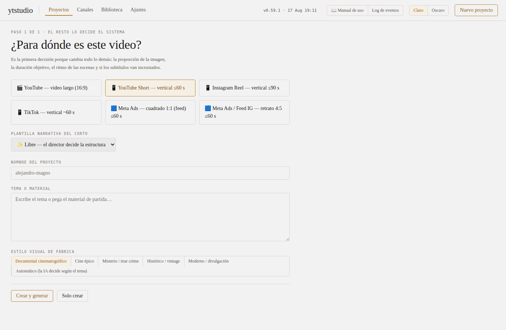

| Formato | Forma de la pantalla | Duración a la que apunta | Subtítulos |
|---|---|---|---|
| **YouTube — video largo** | Horizontal 16:9 | La que pongas en Ajustes (10 min por defecto) | Pista activable |
| **YouTube Short** | Vertical 9:16 | ~55 segundos | Incrustados (siempre visibles) |
| **Instagram Reel** | Vertical 9:16 | ~85 segundos | Incrustados |
| **TikTok** | Vertical 9:16 | ~60 segundos | Incrustados |
| **Meta Ads — cuadrado 1:1** | Cuadrado | ~40 segundos | Incrustados |
| **Meta Ads / Feed IG — retrato 4:5** | Retrato | ~40 segundos | Incrustados |

> **«Subtítulos incrustados»** significa que el texto va pintado dentro de la
> imagen y siempre se ve (imprescindible en redes, donde la gente mira sin
> sonido). **«Pista activable»** es el subtítulo que el espectador enciende o
> apaga en YouTube.

### 4.1 Receta A — Documental largo con TU voz (la mejor para tu canal)

Es la combinación más barata y la que suena a ti.

1. **Graba tu narración** completa en un solo archivo (mp3, wav o m4a).
   Consejos de grabación en el capítulo 13.2. Máximo ~69 minutos por
   archivo; si es más largo, divídelo en dos.
2. **Nuevo proyecto** → formato **YouTube — video largo** → nombre → una
   frase con el tema → **Solo crear** (importante: «Solo crear», para poder
   subir tu voz antes de que empiece).
3. Entra a la pestaña **Material** → **Narración (tu voz)** → **Añadir** y
   sube tu grabación.
4. Si tienes guion escrito, súbelo también en **Guion o notas** (así el
   programa no reinventa nada).
5. Vuelve a **Corrida** y pulsa **Generar video**.

**Qué hace el programa con tu voz:** la transcribe con tiempos exactos,
limpia los tropiezos evidentes (capítulo 13), corta cada escena a la medida
de lo que dices y sincroniza subtítulos y rótulos a tu palabra exacta.

**Costo típico**: unos **$5-7** en total para 18 minutos con 84 escenas
(un plano cada ~13 segundos) e imágenes FLUX 1.1 Pro. Con el **modo híbrido**
(capítulo 11.2) el mismo video baja a **$2-3**. La transcripción de tu voz
cuesta unos **$0.11**.

### 4.2 Receta B — Video largo con voz artificial

Útil para probar formatos rápido o para canales sin locutor.

1. **Ajustes → Proveedores y modelos → Voz en off**: elige el proveedor.
   - **Edge TTS**: **gratis** y sorprendentemente natural. Elige una voz
     **del idioma del video** (la voz no traduce).
   - **Cartesia Sonic**: la más barata con calidad de narración.
   - **OpenAI TTS**: muy barato (~$0.20-0.50 por video de 18 min).
   - **ElevenLabs**: la mejor calidad; se descuenta de tu plan.
2. Crea el proyecto escribiendo solo **el tema** o pegando tu guion en
   **Tema o material**.
3. Pulsa **Crear y generar**.

> 💡 Con voz artificial puedes **alargar o acortar escenas** una por una
> (capítulo 10.4). Con tu voz grabada no: ahí manda tu narración.

### 4.3 Receta C — Short, Reel o TikTok (video vertical corto)

Los formatos cortos verticales (Shorts de YouTube, Reels de Instagram y
TikToks) comparten el mismo lenguaje: gancho en los dos primeros segundos,
texto grande, ritmo alto y subtítulos siempre visibles. El programa los
genera ya con esas reglas puestas.

1. **Nuevo proyecto** → elige **YouTube Short**, **Instagram Reel** o
   **TikTok**.
2. Aparece un desplegable nuevo: **Plantilla narrativa del corto**. Elige la
   estructura (tabla abajo). Es lo que más cambia el resultado.
3. Escribe el tema en una o dos frases. Cuanto más concreto, mejor.
4. **Crear y generar**: un corto son unas 18 escenas, así que es rápido y
   barato (**alrededor de $1** con FLUX 1.1 Pro; céntimos con FLUX schnell).

**Las 7 plantillas de corto:**

| Plantilla | Cómo estructura el video | Ideal para |
|---|---|---|
| ✨ **Libre** | Gancho + desarrollo + cierre, decidido según el tema | Cuando no sabes cuál elegir |
| 🏆 **Top 3 / Ranking** | Cuenta regresiva 3 → 2 → 1, el mejor al final, con la música subiendo | Listas y comparativas |
| 🎭 **Historia con giro** | Empieza en mitad de la acción y suelta un giro inesperado al 70% | Relatos y casos reales |
| 🔁 **Antes / Después** | El problema, el proceso y el resultado, con pantalla dividida | Transformaciones y resultados |
| ❌✅ **Mito vs Realidad** | Enuncia el mito como si fuera cierto y lo desmonta con hechos | Divulgación y desmentidos |
| ⚡ **Tutorial en pasos** | Promete un resultado y da 3-5 pasos concretos | Cómo se hace algo |
| 🤯 **Dato impactante** | Abre con la cifra que rompe la cabeza y luego la explica | Curiosidades y estadísticas |

En los cortos el programa además usa una **biblioteca de 970 ganchos virales
probados** para escribir la primera frase, que es la que decide si alguien se
queda o pasa de largo.

### 4.4 Receta D — Anuncio para Meta (Facebook e Instagram)

1. Elige **Meta Ads — cuadrado 1:1** (para el muro) o **Meta Ads / Feed IG —
   retrato 4:5** (ocupa más pantalla en el móvil).
2. Elige la plantilla **Tutorial en pasos**, **Antes / Después** o **Dato
   impactante**, según lo que vendas.
3. En **Tema o material**, di **qué vendes, a quién y qué quieres que haga**
   el espectador. Ejemplo: «Curso de fotografía para principiantes; público
   de 25-40 años; quiero que se apunten a la clase gratuita».
4. Crea con **Solo crear** y sube tus fotos de producto en **Material →
   B-roll propio**: en un anuncio, tu material real convence más que
   cualquier imagen generada.

### 4.5 Receta E — Video con un presentador en cámara (lipsync)

**«Lipsync»** significa que una foto de una persona se anima para que
**mueva la boca** al ritmo de la narración: parece que habla a cámara.

1. Consigue una **foto frontal, nítida y bien iluminada** del personaje.
2. Crea el proyecto con **Solo crear**.
3. Ve a la pestaña **Personajes** → escribe su nombre, una descripción breve
   (rasgos, época, vestuario), marca **Es el narrador del video**, pulsa
   **Elegir imágenes** y luego **Guardar personaje**.
4. Sube también **tu voz grabada** en **Material**: la boca se moverá con TU
   voz.
5. En **Ajustes → Proveedores → Personaje narrador con lipsync**, empieza
   con **SadTalker**.
6. Vuelve a **Corrida** y pulsa **Generar video**.

> ⚠ **Esto se cobra por segundo de personaje en pantalla, y es lo más caro
> del programa.** Un video de 10 minutos con el personaje un 30% del tiempo
> son 180 segundos de lipsync: con SadTalker son unos $1-4; con **Hedra
> Character-3** unos $9-16; con **OmniHuman** $18-29. **Estrategia: itera con
> SadTalker y deja el modelo caro para la versión final.**

> 💡 En la misma pestaña **Personajes**, debajo del elenco, eliges el
> **porcentaje de presencia** (15 %, 30 %, 45 % o 60 %) y el modo
> **burbuja** (aparece en un círculo sobre el B-roll, estilo reacción). El
> director decide **en qué momentos** aparece con criterio narrativo, y tú
> puedes forzarlo escena a escena en **Escenas → En pantalla**. Tras
> cambiarlo, rehaz desde **Escenas**.

### 4.6 Receta F — Video de reacción

1. Grábate reaccionando al contenido, con o sin fondo verde (el programa
   detecta el fondo verde solo).
2. Súbelo en **Material → Video de reacción**.
3. Con fondo verde te recorta la silueta; sin él te pone en una burbuja
   circular. En los dos casos apareces **durante todo el video**.

### 4.7 Receta G — Copiar el estilo de un video que te gusta

1. Crea el proyecto y ve a **Material → Enlace de referencia (YouTube)**.
2. Pega la dirección y pulsa **Añadir enlace**.
3. El programa lo descarga, escucha su narración y mira sus imágenes para
   aprender el **ritmo de los cortes, la estructura y el estilo visual**.
4. Un solo enlace bueno vale más que tres regulares.
5. Cuando el resultado te guste, **guarda ese estilo** (capítulo 5.6) y
   reutilízalo gratis para siempre.

---

## 5. Antes de generar: preparar el material

Este es el capítulo más rentable del manual. **Cinco minutos aquí te ahorran
dólares y horas de corrección.**

### 5.1 La pestaña Material: todo lo que aportas tú

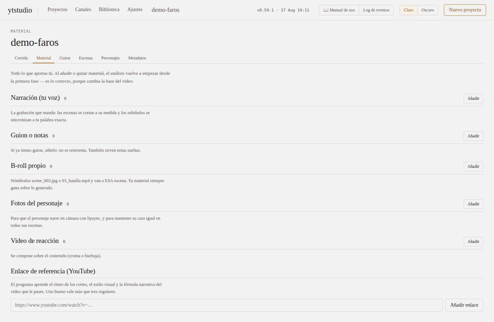

Cada tipo de archivo tiene su sitio, porque de eso depende cómo se usa. Pulsa
**Añadir** en el bloque que corresponda.

| Bloque | Qué poner ahí | Cómo se usa |
|---|---|---|
| **Narración (tu voz)** | mp3, wav, m4a, ogg, opus | Es la voz del video, tal cual, con las escenas ajustadas a ella |
| **Guion o notas** | txt, md, PDF, Word, rtf | Si es un guion, se respeta; si son notas, se usan como base |
| **B-roll propio** | Tus imágenes y videos | Se reparten por el video en lugar de imágenes generadas |
| **Fotos del personaje** | Foto frontal de una persona | Habla en cámara con lipsync y mantiene su cara en todas sus escenas |
| **Video de reacción** | Video tuyo reaccionando | Te compone sobre el video todo el rato |
| **Enlace de referencia** | Una dirección de YouTube | Se analiza para copiar su ritmo y su estilo |

> 💡 **Truco del nombre de archivo:** si nombras tu B-roll `scene_003.jpg` o
> `03_batalla.mp4`, ese archivo va exactamente a **esa** escena. Si no, se
> reparten de forma uniforme.

⚠ Al añadir o quitar material, **el análisis vuelve a empezar desde la
primera fase**. Es lo correcto (cambia la base del video), pero significa que
conviene subirlo todo antes de generar.

> 💡 **Lo más cómodo es subirlo al crear el proyecto**, en el propio
> formulario de **Nuevo proyecto** (capítulo 3, paso 2): así el análisis
> arranca ya con todo tu material y no hay que rehacerlo. Esta pestaña sirve
> para lo que se te olvidó, para lo que quieras cambiar después y para ver de
> un vistazo qué tiene el proyecto.

### 5.2 El elenco: que un personaje tenga siempre la misma cara

Un problema clásico de las imágenes generadas es que el mismo personaje sale
con una cara distinta en cada escena. El **elenco** lo resuelve.

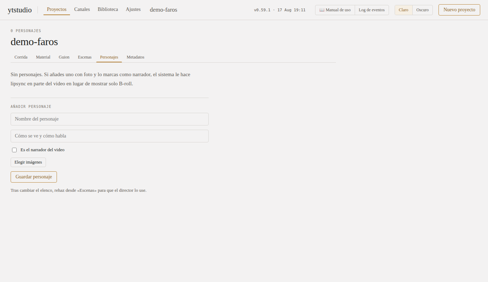

En la pestaña **Personajes**:

1. Escribe el **nombre** del personaje (ej. «Alejandro»).
2. Escribe una **descripción breve**: rasgos, época, vestuario.
3. Marca **Es el narrador del video** si es quien habla a cámara.
4. Pulsa **Elegir imágenes** y sube **una o varias** fotos de referencia.
5. Pulsa **Guardar personaje**.
6. **Importante: después de cambiar el elenco, usa «Rehacer desde →
   Escenas»** para que el director reparta bien los personajes.

Un personaje sin fotos recibe una referencia generada una sola vez, y esa se
reutiliza en todas sus escenas.

**Cuánto sale en cámara.** Debajo del elenco, si hay narrador, aparece
**Presencia del narrador en pantalla**: 15 %, 30 %, 45 % o 60 % del video
hablando a cámara, y la casilla de **burbuja**. ⚠ Es el ajuste que más manda
en la factura cuando hay lipsync, porque se cobra **por segundo en
pantalla**. Tras cambiarlo, rehaz desde **Escenas**.

### 5.3 Cuánto va a costar y el freno automático

En la pestaña **Corrida**, la columna de la derecha muestra **Estimado antes
de generar**: la cifra aproximada del video completo y cuánto tardará. Un
clic despliega el **desglose por fases**, para ver de dónde sale cada dólar.


Además, el programa se pone a sí mismo un **tope de presupuesto** por
corrida: coge la estimación alta de lo que falta por generar y la multiplica
por 1.4 (`budget.margin`). Si la generación intentara pasarse de ahí, **se
detiene sola**. Ese margen absorbe reintentos normales, pero frena un
desbocamiento real.

- ¿Quieres un candado más estricto? Pon un número en `budget.max_usd`
  (0 = sin techo manual). Solo manda cuando es **más** restrictivo que el
  automático: nunca sirve para gastar más.
- El tope se recalcula antes de cada paso, así que en cuanto existen las
  escenas reales el cálculo se vuelve exacto.
- El **gasto real** aparece en la columna derecha de **Corrida** en cuanto
  termina cada fase.

> 💡 La estimación es **aproximada**: usa las tarifas públicas de los
> proveedores y el número de escenas previsto. En cuanto existe el guion
> gráfico, el cálculo se afina porque ya sabe cuántas escenas hay de verdad.

### 5.4 El banco de elementos: material tuyo, gratis y para siempre

Cuando tu narración menciona a una persona, un lugar o una institución, el
programa puede superponer un **inserto**: una tarjeta con la foto real, la
cifra animada o el mapa, encima de la imagen de fondo. Es lo que hace que un
video parezca profesional.

El **banco de elementos** es tu archivo propio para esos insertos, y vive en
la pantalla **Biblioteca**.

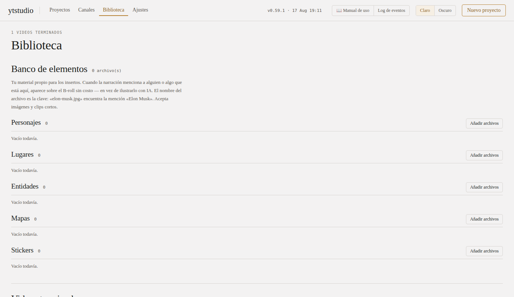

**Cómo llenarlo, paso a paso:**

1. Entra a **Biblioteca**.
2. Elige la categoría: Personajes, Lugares, Entidades y marcas, Mapas o
   Stickers.
3. Pulsa **Añadir** y sube imágenes o clips cortos (mp4, webm, mov).
4. **El nombre del archivo es la clave**: `elon-musk.jpg` se encuentra
   cuando la narración dice «Elon Musk». No importan tildes ni mayúsculas.

**Reglas de oro del banco:**

- **Tu material siempre gana** sobre la búsqueda automática en internet.
- Usa solo material **de uso libre o propio** (Pixabay, Pexels, Openverse,
  Wikimedia con licencia libre). El programa no puede verificarlo por ti.
- **Llénalo una vez, rinde para siempre**: pon los 10-20 nombres que se
  repiten en tu canal (personajes recurrentes, países, instituciones) y se
  reutilizarán en todos tus videos futuros, gratis.

### 5.5 Estilos de canal: la identidad, guardada y reutilizable

Cuando un video te guste, **guarda su estilo** y arranca los siguientes con
la misma identidad **sin pagar el análisis otra vez**.

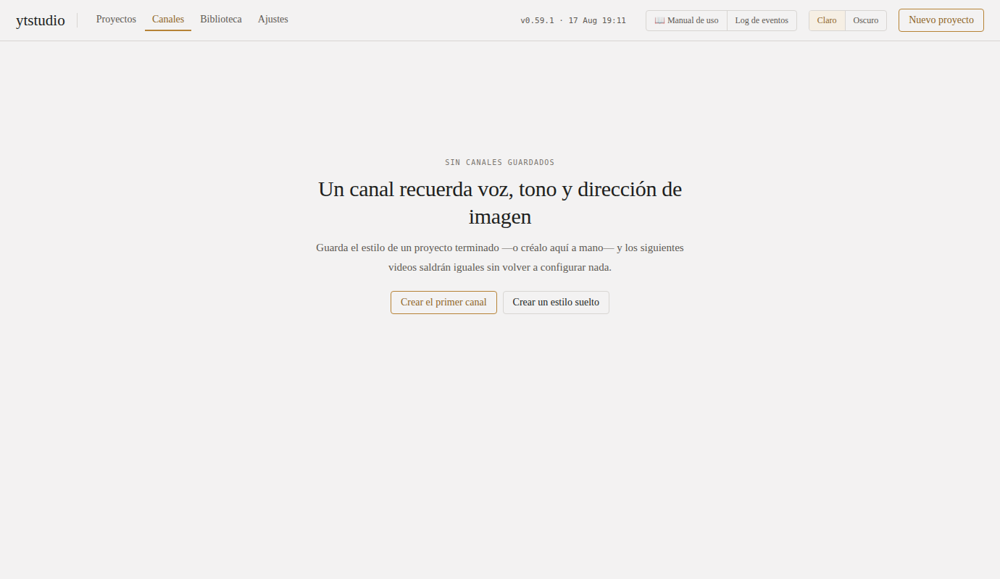

En la pantalla **Canales** creas canales (para agrupar) y estilos. Un estilo
guarda: la descripción visual, el prefijo que se antepone a cada imagen, la
paleta de colores, el tono de la narración, la música, el ritmo, las
transiciones, la **fórmula narrativa** de tu canal y el **branding de los
rótulos**:

| Ajuste del rótulo | Opciones |
|---|---|
| **Tipografía** | Moderna (limpia) · Editorial (con aire de prensa) · Impacto (gruesa, viral) · Mono (técnica, de datos) |
| **Diseño** | Documental (placa oscura sobria) · Minimal (solo una línea de acento) · Bold (placa de color, máxima presencia) |
| **Colores** | Color de acento y color del texto |

Hay **cuatro combinaciones de un clic** para empezar: Documental clásico,
Impacto viral, Tech / datos y Minimalista.

**Usarlo:** al crear un proyecto, en **Tu estilo guardado (canal)**, elige el
estilo. Ese proyecto nace con la identidad ya puesta.

---

## 6. Generar: los 11 pasos y el punto de control

### 6.1 Los controles de la pestaña Corrida

| Control | Qué hace |
|---|---|
| **Generar video** | Empieza (o **reanuda** donde se quedó, sin volver a pagar lo hecho) |
| **Desplegable de al lado** | Hasta dónde llegar: **Video completo**, **Solo hasta el guion** o **Hasta el guion gráfico** |
| **Editar guion** | Salta a la pestaña Guion |
| **Renombrar** | Cambia el nombre visible del proyecto |
| **Rehacer desde…** | Vuelve a hacer un paso concreto **y todos los siguientes** |
| **Guardar estilo** | Guarda la identidad de este video (dirección visual, tono, música, ritmo, fórmula) para reutilizarla en otros |
| **Duplicar** | Copia el proyecto entero para probar una variante sin tocar el bueno |
| **Borrar** | Elimina el proyecto y sus archivos (no se puede deshacer) |
| **Log de eventos** (columna izquierda) | Despliega el registro en vivo de la corrida |
| **Estimado antes de generar** (columna derecha) | Cuánto costará y cuánto tardará, con desglose |

### 6.2 Los 11 pasos, y cuál cuesta dinero

| # | Paso | Qué hace | ¿Cuesta? |
|---|---|---|---|
| 1 | **Análisis** | Lee tu material, transcribe tu voz, estudia la referencia | Bajo |
| 2 | **Concepto** | Define estilo visual, tono y dirección musical | Bajo |
| 3 | **Guion** | Escribe el guion, o adopta el tuyo | Bajo |
| 4 | **Escenas** | Divide en escenas y diseña prompts, rótulos, música, sonido e insertos | Medio |
| 5 | **Voz** | Monta la pista de voz con respiros naturales | Bajo o nulo |
| 6 | **Imágenes** | Genera imágenes y clips, resuelve insertos y revisa la calidad | **ALTO — aquí está casi todo el gasto** |
| 7 | **Música** | Banda sonora por tramos + cama de ambiente | Bajo |
| 8 | **Subtítulos** | Subtítulos sincronizados a la voz real | Nulo |
| 9 | **Montaje** | Une, anima, superpone y mezcla (en tu PC) | Nulo |
| 10 | **Metadatos** | 3 títulos, 3 descripciones y 3 miniaturas | Bajo |
| 11 | **Publicación** | Deja el paquete final listo | Nulo |

### 6.3 EL momento clave: el punto de control del storyboard

Al terminar el paso **Escenas**, el programa escribe esto en el registro en
vivo, justo antes del paso que gasta el dinero:

```
📋 PUNTO DE CONTROL — storyboard listo: 84 escenas · ~18 min
   Revísalo en 04_scenes/storyboard.md
   💰 Falta por generar: ~$8.09-$16.91
   ⚠ Corregir AQUÍ no cuesta nada; corregir después cuesta volver a generar.
```

**Léelo siempre.** Es el último punto en el que cambiar algo es gratis.

⚠ **El programa no se para solo ahí**: si pediste el video completo, sigue de
largo hacia las imágenes. Para detenerte justo en ese punto, elige **«Hasta
el guion gráfico»** en el desplegable de al lado de **Generar video**,
**antes** de pulsarlo. Es la costumbre que más dinero ahorra.

Después aprovecha para:

1. Leer el **guion** (pestaña Guion) y corregir lo que no te guste.
2. Revisar las **escenas** una por una (pestaña Escenas).
3. Subir **tu propio B-roll** a las escenas que quieras (capítulo 10.4).

---

## 7. Durante la generación: qué vigilar

En la pestaña **Corrida**, la fase activa se resalta con su porcentaje y el
tiempo restante. El botón **Log de eventos** de la columna izquierda abre el
registro en vivo, y la columna **Atención** recoge lo que necesita que
decidas.

**Puedes cerrar el navegador**: la generación continúa en la ventana negra.
Si cierras la ventana negra, se detiene (y luego se reanuda sin perder nada).

**Mensajes normales — no te asustes:**

| Mensaje | Qué significa |
|---|---|
| `⏳ OpenAI limita… espero 12s y reintento` | El proveedor pide ir más despacio; el programa se autorregula |
| `⏳ Anthropic no responde (429)… espero y reintento` | Lo mismo: **429** es «demasiadas peticiones». Se resuelve solo |
| `🔄 El contenido de N escenas cambió` | Rehace solo esas, no todas |
| `🎬 Diseño de escenas (tanda 2/3)` | Normal en videos largos: se trabaja por tandas |

**Mensajes que SÍ debes leer:**

| Mensaje | Qué significa | Qué hacer |
|---|---|---|
| `✂ Corregido en tu narración [12.3s, −1.4s]` | Se quitó un tropiezo de tu grabación | Mira los segundos: si el número es grande, escucha esa parte |
| `🛡 Descarté una corrección propuesta…` | El programa evitó borrar algo tuyo | Nada: es una buena noticia |
| `⚠ Sin foto de licencia libre para…` | Ese inserto no se pudo ilustrar | Añade el archivo a tu banco de elementos |
| `🔊 Detecté habla MUY BAJA en…` | Un tramo tuyo suena flojo | Se conserva igual; valóralo al revisar |
| `💰 Hay N resultados ya PAGADOS que no se descargaron` | Se cobró algo que no llegó | Pulsa **Generar video** dentro de la hora siguiente: se recuperan **sin volver a cobrar** |

Si la corrida se detiene con un error, la columna **Atención** te ofrece
**Reintentar** (desde donde se cayó) o **Reintentar desde el principio**.

---

## 8. Después: revisar, elegir y publicar

El video terminado se reproduce en la pestaña **Corrida**, y en **Metadatos**
eliges cómo se presenta en YouTube.

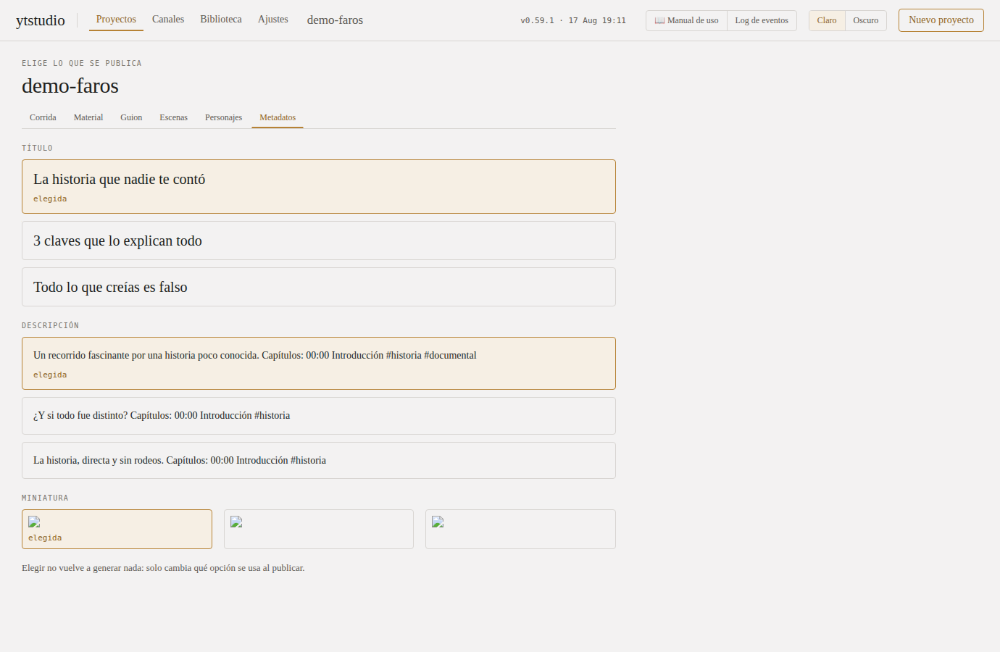

**Paso a paso:**

1. **Mira el video entero.** Sí, entero, antes de publicarlo.
2. **Elige la miniatura**: hay 3 diseños. Un clic la selecciona.
3. **Elige el título**: 3 estrategias distintas para que la gente haga clic
   (curiosidad, dato concreto, contradicción).
4. **Elige la descripción**: 3 enfoques. Incluyen **capítulos automáticos**
   (los minutos marcados) y los **créditos** del material de archivo.
   ⚠ **No borres los créditos**: son obligatorios por la licencia de las
   fotos libres.
5. **Revisa el gasto real** en la columna derecha de **Corrida**. Eso es lo
   que de verdad se consumió, no una predicción.

Todos los archivos quedan en la carpeta `projects/<tu-proyecto>/09_final/`:
`video_final.mp4`, `miniatura.jpg` y `metadata.json`, más los subtítulos en
`08_subtitles/subtitulos.srt`.

**Subir el video:** entra a YouTube Studio y sube el mp4, la miniatura y el
archivo de subtítulos, y pega el título y la descripción que elegiste.
(Existe una subida automática opcional: se activa poniendo `publish.enabled`
en verdadero y requiere las credenciales de Google del capítulo 18.1. Por
defecto está apagada.)

---

### 8.1 Los verticales llevan una revisión técnica aparte

Un Short, un Reel o un TikTok no se ven en una pantalla limpia: **la app dibuja
su interfaz ENCIMA de tu video**. Arriba el título, a la derecha la columna de
botones (me gusta, comentarios, compartir) y abajo el nombre de tu canal y el
**enlace al video largo**. Ese enlace es lo único que convierte a alguien que
ve un Short en alguien que ve tu video de diez minutos.

Al rectángulo del centro que sí es tuyo se le llama **zona segura** (el
espacio donde ningún botón de la app te va a tapar el texto). Por eso el
programa ahora trata la franja de abajo como terreno prohibido:

- **Los subtítulos de los verticales suben.** Antes se quemaban pegados al
  borde inferior, justo encima del enlace: lo tapaban. Ahora se colocan por
  encima de esa franja, sin que tengas que hacer nada.
- **En los videos horizontales no cambia nada.** Ahí no hay interfaz encima.

En la pestaña **Corrida**, debajo del video, los proyectos verticales muestran
una tarjeta de **Revisión técnica del vertical**:

| Qué mide | Por qué importa |
|---|---|
| Tamaño y proporción | Si no es vertical, YouTube no lo trata como Short |
| Duración | Pasando de 3 minutos deja de ser Short; pasando de 60 segundos, una reclamación de música **bloquea el video en todo el mundo** (no lo desmoneta: lo bloquea) |
| Sonoridad (LUFS) | Lo importante. Ver abajo |
| Pico de sonido | Por encima del límite, se oye distorsión después de que YouTube recomprima |

**Lo de la sonoridad conviene entenderlo, porque es el error más caro y el más
barato de arreglar.** YouTube **baja** los videos que suenan demasiado alto,
pero **no sube** los que suenan bajo. Si tu video sale apagado, sale apagado
para siempre: sonará a la mitad de volumen que el anterior del feed, en un
teléfono, con altavoz, probablemente en la calle. Y el espectador no piensa
«esto está bajo»: desliza y se va.

Antes el programa **suponía** que la mezcla acababa en el nivel correcto.
Ahora lo **mide** en el archivo terminado y, si no está, lo corrige subiendo o
bajando todo por igual (las pausas y los silencios de tu montaje quedan
exactamente como estaban). Lo verás en el registro como
«🔊 Sonoridad corregida».

**El botón «Medir el archivo»** vuelve a medir cuando quieras. Es gratis: solo
lee el archivo, no gasta ni un centavo ni llama a ninguna IA.

**Lo que ninguna medición puede ver, y tienes que mirar tú:**

- ¿Hay **texto en pantalla desde el primer fotograma**? La mayoría de la gente
  ve los Shorts sin sonido: si tu gancho solo se oye, no existe.
- ¿El final **cierra**, o corta en seco?
- ¿La franja de abajo quedó libre?

**Míralo en un teléfono de verdad**, no en el ordenador: la interfaz de la app
cambia entre iPhone y Android, y solo ahí ves qué tapa qué.

> 📐 **Si editas algo a mano en otro programa** (Premiere, DaVinci, CapCut),
> tienes la guía en `assets\plantillas\PLANTILLA_ZonaSegura_1080x1920.png`:
> arrástrala a una pista por encima del video, pon tu texto dentro del
> rectángulo verde y **apaga esa pista antes de exportar**. Las instrucciones
> están en `assets\plantillas\README.md`. Para lo que genera el programa no
> hace falta: ya lo hace solo.

---

## 8.2 Sacar Shorts de un video largo

Cuando tienes un video largo terminado, el programa puede leerlo entero y
sacarle los Shorts que lleven gente a verlo.

### Lo primero, porque casi todo el mundo se equivoca aquí

**Un Short viral NO arrastra tu video largo.** YouTube usa dos sistemas de
recomendación separados, uno para vídeo corto y otro para largo. Que un Short
haga un millón de visitas no empuja nada hacia tu documental de diez minutos.

Lo único que construye ese puente es el **enlace a video relacionado**: un
enlace que aparece en el Short, debajo del nombre de tu canal, y que lleva al
video largo. Lo pones tú, a mano, y **es gratis**. Un Short sin ese enlace es
una vista regalada: entretiene a alguien y lo deja donde estaba.

Todo lo que hace esta función está pensado alrededor de eso.

### Cómo se hace

1. Abre el **proyecto del video largo** y entra en la pestaña **Shorts**.
2. Elige **cuántos** quieres (3 a 7) y pon la **fecha** en que publicas —o
   publicaste— el video largo. De esa fecha sale el calendario.
3. Pulsa **Proponer Shorts**. Tarda menos de un minuto y cuesta unos pocos
   céntimos: es una sola consulta al director.
4. Te salen las piezas propuestas. De cada una ves el guion completo, qué
   texto va en pantalla y de qué minuto del video largo sale. **Desmarca las
   que no te convenzan.**
5. Pulsa **Crear los proyectos**. Se crean como borradores con el guion ya
   escrito. **Todavía no se genera ningún video ni se gasta nada.**
6. Abre cada uno y pulsa **Generar video** cuando quieras.

> 💡 **También funciona con cualquier video de YouTube**, no solo con los
> tuyos: pega el enlace en la casilla de abajo. Si el video tiene subtítulos,
> el programa los lee con sus minutos y saca los Shorts igual, sin descargar
> el video (que puede ser de horas).

### Qué escribe exactamente

Cada pieza sale con la estructura completa, no con un trozo recortado:

| Bloque | Qué es |
|---|---|
| **Gancho** | La primera frase, dicha antes del medio segundo. Sin saludos ni «en este video te voy a explicar» |
| **Texto en pantalla** | El mismo gancho, escrito, desde el primer fotograma. La mayoría ve los Shorts **sin sonido**: si tu gancho solo se oye, no existe |
| **Promesa** | Qué se lleva quien se quede |
| **Desarrollo** | **Una sola idea.** Si un momento tiene dos, son dos Shorts |
| **Pago** | Se cumple lo prometido. Es el bloque que casi todos se saltan, y por el que luego no entienden por qué no reciben «me gusta»: el «me gusta» se decide justo ahí |
| **Llamada a la acción** | Una sola, al final, **hacia tu video largo** — nunca «suscríbete» |
| **Cierre de bucle** | La última frase enlaza con la primera. Los Shorts se repiten solos: así la gente lo ve dos veces sin darse cuenta |

### Los ganchos se rotan, y no es por gusto

El programa exige al director que use al menos **cuatro estructuras de gancho
distintas** en cada tanda, y te avisa si no lo consigue. La razón no es
estética: publicar siempre con la misma fórmula es exactamente lo que las
normas de YouTube describen como **producción en masa**, y eso sí tiene
consecuencias. Variar es la defensa.

### El calendario

Las piezas no salen todas de golpe. Cada una recibe un día alrededor del
video largo (D0 = el día que publicas el largo):

| Día | Función |
|---|---|
| **D−4** | Posicionamiento — por qué existe tu canal |
| **D−2** | Promesa — una curiosidad que el video largo resolverá |
| **D0** | Activación — pregunta directa, para que haya comentarios el día clave |
| **D+2** | Profundización — el concepto central |
| **D+4** | Emoción — la pieza con más carga |
| **D+7** | Expansión — la que funciona fuera de tu tema: trae público nuevo |
| **D+9** | Puente — enlaza con tu siguiente video largo |

El orden va de lo general a lo específico a propósito: las piezas que
necesitan contexto van **después** del video largo, cuando ese contexto ya
existe para recibir el clic.

**Publica tres o cuatro Shorts por semana, no a diario.** El riesgo del diario
no es que YouTube te castigue el algoritmo: es que la calidad del gancho se
degrada cuando el calendario aprieta, y que la cadencia diaria con plantilla
fija es el patrón de producción en masa otra vez.

### ⚠ El único paso que hay que hacer a mano

**Poner el enlace al video largo.** No se puede hacer desde fuera de YouTube:
no hay forma. Al subir cada Short:

1. Entra en **YouTube Studio** → **Contenido**
2. Haz clic en el Short
3. Busca **Video relacionado** y elige tu video largo
4. Guarda

El programa te dice exactamente qué video enlazar: está en la pestaña
**Shorts** de cada Short creado, junto con el título, la descripción y los
hashtags que le tocan.

> 💡 **Se puede añadir DESPUÉS de publicar**, y esto casi nadie lo aprovecha:
> el feed de Shorts no caduca. Cuando saques un video largo nuevo, puedes
> volver a tus Shorts antiguos —los que ya acumularon visitas— y reapuntarlos
> al video nuevo. Tu catálogo de Shorts se convierte en algo que puedes
> reutilizar en vez de en piezas de un solo uso.

---

### 8.3 Antes de publicar un vertical: la lista de comprobación

Cuando un proyecto vertical tiene su video terminado, debajo de la revisión
técnica aparece la tarjeta **«Antes de publicar»**. Es una lista con tres
tipos de punto:

| Marca | Qué significa |
|---|---|
| ✔ | La máquina lo comprobó y está bien |
| ✖ | La máquina lo comprobó y está **mal** — arréglalo antes de subir |
| ☐ | **Solo lo puedes mirar tú.** Son justo los que más se olvidan |

Lo que se comprueba solo: la revisión técnica del archivo, que el título
tenga entre 40 y 70 caracteres, que no lleve el hashtag de Shorts (no hace
falta: YouTube clasifica solo por proporción y duración), que la descripción
tenga 2-3 hashtags y enlace al video largo, que haya como mucho 5 tags y que
el archivo de subtítulos esté generado.

Lo que miras tú (los ☐): poner el **enlace a video relacionado** en Studio,
que el gancho se entienda **con el sonido apagado**, declarar **contenido
sintético** si aplica, y revisarlo **en un teléfono real**.

La lista se actualiza sola: si cambias el título elegido en Metadatos, se
recalcula.

**Los metadatos de los verticales ya salen con las reglas del formato.** Y si
el Short salió de un video largo (apartado 8.2), el título y la descripción
que decidió el plan editorial aparecen como primera opción — el resto son
variantes.

**Al publicar desde el programa** (con `publish.enabled` activado), además:
el archivo de subtítulos se sube aparte automáticamente, y si la miniatura de
Short todavía no está disponible en tu canal (YouTube la está desplegando
poco a poco), se avisa sin estropear nada: el video ya queda subido.

> 🔑 **Un aviso sobre permisos.** Para subir los subtítulos hizo falta pedir
> un permiso más en la autorización de Google. Si publicas con una
> autorización antigua y los subtítulos fallan, el arreglo es: borra el
> archivo `token.json` de la carpeta del programa y vuelve a publicar (te
> pedirá autorizar de nuevo, una sola vez). El video y la miniatura suben
> igual que siempre aunque no lo hagas.

---

### Comprobar que la actualización llegó de verdad

Actualizar tiene **dos pasos**, y saltarse el segundo es el despiste más
común:

1. **`actualizar.bat`** trae los archivos nuevos.
2. **Cerrar el programa y volver a abrirlo** con `iniciar.bat`. Mientras no lo
   hagas, sigue corriendo la versión vieja aunque los archivos ya sean nuevos.

**Cómo saber en qué versión estás:** míralo **arriba a la izquierda** en la
interfaz, junto al nombre `ytstudio`. Ese número sale de los archivos de tu
equipo, así que es la verdad.

> ⚠ **«Actualicé pero sigo en la versión de antes».** Desde la v0.65.3,
> `actualizar.bat` te dice si funcionó o no, y en qué versión te deja. Si
> sale **«NO SE PUDO ACTUALIZAR»**, la causa casi siempre es una de tres, y
> el propio archivo te da el comando para cada una. Si sale **«YA ESTABAS AL
> DÍA»** pero esperabas algo más nuevo, es que estás en otra **rama**: el
> archivo te dice en cuál.
>
> En ambos casos: **copia todo lo que salga en la ventana negra y pásamelo.**

---

### 8.4 Dos maneras de hacer el Short: recortar o generar

Al proponer Shorts de un video largo eliges **cómo se fabrican**. Es la
decisión que más cambia el resultado y el coste:

| | ✂ **Recortar del video original** | 🧬 **Generar una pieza nueva** |
|---|---|---|
| Qué hace | Baja el **tramo exacto** del video y lo pone vertical | Escribe un guion nuevo y genera voz, imágenes y montaje |
| La voz | **La tuya**, la del video publicado | Sintetizada |
| La imagen | **Tu edición**, tal como está | Imágenes generadas |
| Qué cuesta | Solo el rato de descargar y montar. **No gasta** en voz ni en imágenes | Unos dólares y varios minutos por pieza |
| Cuándo usarlo | Casi siempre. Si el momento ya funciona grabado | Cuando lo que quieres decir **no está dicho** en el largo de forma que aguante solo |

**Viene puesto el recorte**, por tiempo y por dinero. Puedes cambiarlo para
toda la tanda antes de proponer, y **pieza a pieza** después, en cada ficha.

> 💡 **Si editaste el video por fuera del programa**, el recorte usa la
> versión **publicada en YouTube** —la buena—, no la que salió del programa.
> Por eso conviene pegar el enlace del video en la casilla.

**Qué se le añade al recorte**, y es lo que lo convierte en un Short de
verdad y no en un trozo suelto:

- Se reencuadra a vertical **sin perder imagen**: el fotograma entero va sobre
  su propia imagen ampliada y desenfocada, de modo que la pantalla se llena.
  (En **Ajustes** puedes elegir el recorte centrado, que llena el cuadro pero
  se come los lados: úsalo solo si el sujeto va siempre centrado.)
- Se le ponen los **subtítulos del propio video**, con sus tiempos, por encima
  de la franja del enlace al video largo.
- Se le pone el **texto de gancho arriba desde el primer fotograma**: la
  mayoría verá el Short sin sonido, y sin ese texto el gancho no existe.
- Se **mide y corrige la sonoridad**, porque un recorte hereda el volumen del
  original, que casi nunca está donde debe.

**La duración de un recorte es la del tramo**, no una duración a elegir: si el
momento va del 1:04 al 1:59, el Short dura esos 55 segundos y eso es lo que
dice su ficha. Un tramo que se pase de **60 segundos se corta ahí mismo** —por
encima del minuto, una reclamación de copyright puede bloquear el Short en
todo el mundo.

> ⚠ **El recorte necesita el enlace del video.** Si sacas los Shorts del
> material del proyecto (sin pegar enlace), no hay video que descargar y todas
> las piezas se generarán de cero. El programa te lo dice al proponer.

---

## 9. Corregir sin volver a pagar

Esta es la tabla que más dinero te va a ahorrar. **Rehacer desde un paso
regenera ese paso y todos los siguientes**: por eso importa elegir bien desde
dónde.

| Quiero cambiar… | Qué hago | ¿Pierdo lo ya pagado? |
|---|---|---|
| Una imagen concreta | Subo la mía en **Escenas → Subir** | No |
| Rótulos, movimiento de cámara, transiciones, efectos | Los cambio en **Escenas** y pulso **Guardar cambios** | No |
| El sonido de los insertos o el volumen de la música | Lo cambio en **Ajustes** y rehago desde **Montaje** | No |
| Todas las imágenes (cambiar de modelo) | Rehacer desde **Imágenes** | Sí, solo las imágenes |
| El texto del guion | Lo edito en **Guion** y guardo | Sí, de ahí en adelante |
| El estilo visual completo | Rehacer desde **Concepto** | Sí, casi todo |
| Probar una variante sin arriesgar | **Duplicar** el proyecto y trabajar sobre la copia | No: el original queda intacto |

> ⚠ **Nunca rehagas desde Concepto, Guion o Escenas para arreglar una
> imagen.** Eso reescribe los prompts, **borra las imágenes que ya pagaste** y
> las vuelve a cobrar. Para una imagen concreta: sube la tuya, o rehaz desde
> **Imágenes**.

---

## 10. Las pantallas del programa, una por una

### 10.1 Proyectos

La lista de todos tus videos, con su avance. Un clic en la fila entra al
proyecto. Arriba a la derecha hay dos controles:

- **Buscar…** filtra por nombre según escribes.
- El desplegable de al lado filtra **por estado**: Todos, **En curso**,
  **Completos** o **Con errores**. Con veinte proyectos, «cuál se quedó a
  medias» deja de ser una pregunta que hay que responder mirando fila por
  fila.

Al final de cada fila hay tres botones: **✎ renombrar** (cambia el nombre
visible sin entrar al proyecto), **⧉ duplicar** (copia el proyecto para
probar una variante) y **🗑 borrar** (elimina el proyecto y sus archivos; no
se puede deshacer).

### 10.2 Corrida

El puesto de mando: las 11 fases a la izquierda, el video y la miniatura en
el centro, y a la derecha **Atención**, el **estimado antes de generar** y el
**gasto real** (desglosado **por proveedor**, para ver qué se está llevando
el dinero, con el total abajo). Todos sus botones están en el capítulo 6.1.

Cuando el video está montado, debajo aparece una línea de **Descargar** con
los tres archivos que necesitas para publicar: **video_final.mp4**,
**subtitulos.srt** y **miniatura.jpg**.

### 10.3 Guion

El texto completo de la narración. Edítalo libremente y guarda. Al guardar,
los pasos posteriores se regeneran (porque las escenas dependen del texto).

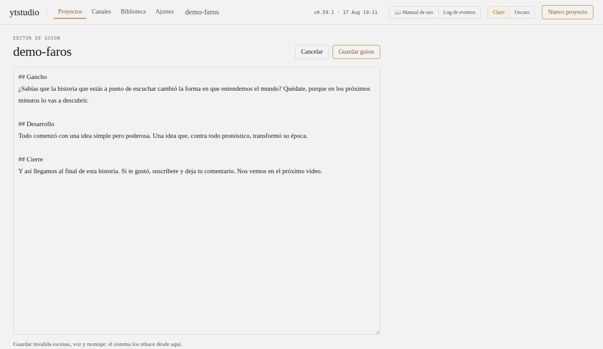

### 10.4 Escenas

Cada escena en una fila: su imagen, su narración, y los controles de lo que
se puede rehacer **barato** (solo hay que volver a montar, sin coste de
inteligencia artificial).

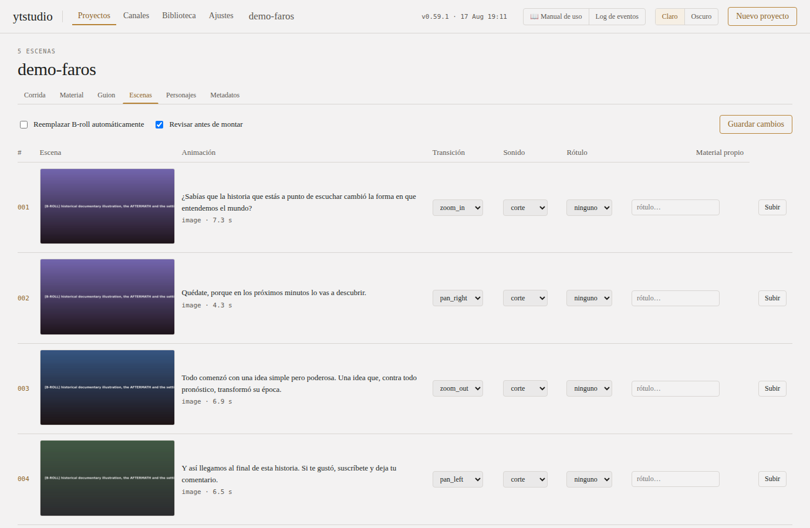

| Control | Qué cambia |
|---|---|
| **En pantalla** | Quién ocupa la escena: B-roll ilustrativo o el personaje hablando (solo si hay narrador; el lipsync se cobra por segundo) |
| **Animación** | Zoom in, zoom out, paneo izquierda/derecha o estática |
| **Transición** | Corte seco o fundido |
| **Sonido** | Ninguno, whoosh, riser o boom en la entrada de la escena |
| **Música** | La intensidad musical de esa escena, de mínima a clímax: es el arco dramático del video |
| **Duración** | Cuántos segundos dura la escena. Solo con voz artificial: con tu voz grabada la manda tu narración y aquí se muestra sin poder tocarla |
| **Rótulo** | El texto en pantalla, su **encabezado** (la línea pequeña de encima) y su **tipo** (personaje, lugar, fecha, dato, lista, conclusión) |
| **Subir** | Tu propia imagen o video para esa escena concreta |

Arriba hay dos casillas que deciden qué hace el programa con tu material:

| Casilla | Si está marcada | Si la desmarcas |
|---|---|---|
| **Revisar antes de montar** | El director comprueba con visión IA que tu imagen encaje con la escena y te avisa | Tu material se usa tal cual (gasta menos) |
| **Reemplazar B-roll automáticamente** | Sustituye tu imagen si cree que no pega | Se respeta siempre tu elección y solo te avisa |

Cuando termines: **Guardar cambios**.

### 10.5 Personajes

El elenco del video. Ver capítulo 5.2.

### 10.6 Material

Todo lo que aportas tú. Ver capítulo 5.1.

### 10.7 Concepto

La decisión de fondo del video, escrita por la IA en la segunda fase: los
**títulos propuestos**, el **ángulo**, la **audiencia**, el **tono**, la
**dirección musical**, la **estructura** del video paso a paso y el **estilo
visual** con su paleta de colores.

Es la pantalla que conviene leer **antes de gastar en voz e imágenes**,
porque de aquí sale todo lo demás: si el ángulo o la audiencia no son los que
querías, corregirlo ahora es gratis. Para cambiarlo, edita el guion o el
material y **rehaz desde «Concepto»** en la pestaña Corrida.

Desde aquí también puedes **guardar este estilo en un canal** y reutilizarlo
en videos futuros sin volver a pagar el análisis (capítulo 5.5).

### 10.8 Metadatos

Las 3 propuestas de título, descripción y miniatura. Ver capítulo 8.

### 10.9 Canales y Biblioteca

**Canales**: la identidad guardada de cada canal (capítulo 5.5).
**Biblioteca**: el banco de elementos (capítulo 5.4).

### 10.10 Ajustes

Se divide en cinco bloques. Guarda con **Guardar ajustes** (y **Guardar
proveedores** para el bloque de modelos).

**a) Plantilla de la interfaz** — capítulo 2.6.

**b) Video y voz:**


| Ajuste | Qué hace | Recomendación |
|---|---|---|
| **Idioma** | Guion, voz, subtítulos y metadatos | El tuyo. Con Edge TTS elige además una voz de ese idioma |
| **Estilo visual** | El aspecto de fábrica de las imágenes | Documental cinematográfico para historia y divulgación seria |
| **Duración objetivo** | A cuántos minutos apunta el guion | La normal de tu canal |
| **Segundos por escena** | Cada cuánto cambia la imagen | ~6 s dinámico · ~8-10 s estándar · ~15 s contemplativo |
| **Volumen de la música** | Cuánto suena por debajo de la voz | −21 dB va bien casi siempre |
| **Formato de salida** | Resolución y proporción | Full HD: 2K y 4K tardan mucho más y casi no se nota |
| **Subtítulos incrustados** | Quemados en la imagen o pista activable | Pista activable en YouTube; incrustados en redes |
| **Bajar la música cuando hablas** | El «ducking» | Déjalo activado |
| **Efectos de sonido en los insertos** | El acento sonoro de las tarjetas | Activado |

> 💰 **Los segundos por escena son un interruptor de gasto**: planos más
> cortos = más imágenes = más costo. En un video de 18 minutos, un plano cada
> 6 segundos son ~180 imágenes; cada 10 segundos, ~108; cada 13 segundos, ~84.

**c) Proveedores y modelos** — el bloque donde está la factura del programa.
Cada opción muestra su precio, su punto fuerte y su punto débil.

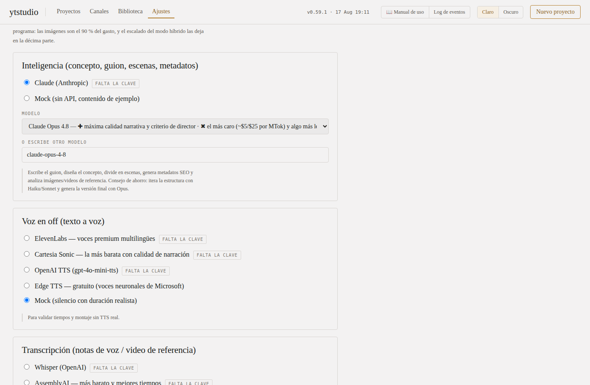

**d) Claves de API** — capítulo 2.2.

**e) Versión** — qué versión corre, y los avisos de actualización.

### 10.11 Log de eventos

El historial completo: novedades, avisos, errores y el tiempo de cada paso.

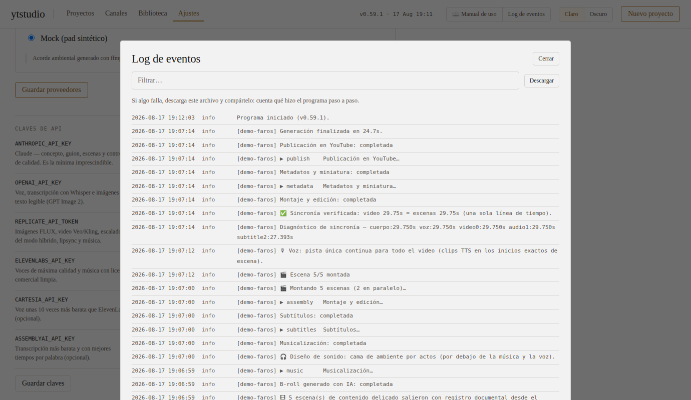

---

## 11. Ahorrar dinero sin perder calidad

### 11.1 Cuánto cuesta de verdad

La referencia es un video de **~18 minutos con 84 escenas** (un plano cada
~13 segundos). Ojo: el número de escenas manda sobre todo lo demás. Con un
plano cada 6 segundos ese mismo video tendría ~180 escenas y las imágenes
costarían el doble.

| Concepto | Costo aproximado |
|---|---|
| Inteligencia: guion, escenas, dirección de arte, control de calidad | $1-3 |
| **Modo híbrido** (FLUX schnell + escalado) — la opción más rentable | **$0.40-0.60** |
| Imágenes con SDXL Lightning (borradores) | $0.13-0.17 |
| Imágenes con FLUX schnell (sin escalar) | $0.25-0.35 |
| Imágenes con FLUX 2 Flash | $1.3-2.1 |
| Imágenes con FLUX dev | $2.0-2.5 |
| Imágenes con Ideogram v3 Turbo (buena tipografía) | ~$2.5 |
| **Imágenes con FLUX 1.1 Pro** (la referencia de la casa) | **$3.4-4.2** |
| Imágenes con FLUX 2 Pro | $4.6-6.3 |
| Imágenes con GPT Image 2, calidad media | $2.5-5 ⚠ |
| Video generativo, 18 clips (Kling v1.6) | $2.3-6.3 ⚠ |
| Video generativo, 18 clips (Veo 3.1 Fast, con audio propio) | ~$13.5 ⚠ |
| Transcribir tu voz, 18 min (Whisper) | ~$0.11 |
| Transcribir tu voz, 18 min (AssemblyAI) | ~$0.05 |
| Voz artificial de OpenAI | $0.20-0.50 |
| Voz artificial de Cartesia | ~$0.19 |
| Voz artificial de Edge | gratis |
| Música generada (MusicGen) | $0.05-0.15 |
| Montaje, subtítulos, insertos, mapas y ambiente | gratis (se hacen en tu PC) |

### 11.2 El modo híbrido: la mayor palanca de ahorro

Genera las imágenes con un modelo barato y **súbeles la resolución después**
con un escalador (~$0.002 por imagen). Las 84 imágenes pasan de ~$4 a menos
de $0.60: un **90% menos**.

**Cómo activarlo:** **Ajustes → Proveedores y modelos → Imágenes IA** →
elige **FLUX schnell** como modelo y activa **MODO HÍBRIDO: escalar las
imágenes tras generarlas**.

**Lo que el escalado hace y lo que no:** recupera **resolución**, no calidad
de origen. No inventa la microtextura ni la iluminación fina de un modelo
caro. Pruébalo con tu tema antes de adoptarlo para la versión final.

Las imágenes que **ya dan la talla** (tu B-roll, los respaldos locales) se
saltan solas: activarlo nunca cobra de más por ellas.

### 11.3 Las siete reglas del ahorro

1. **Prueba barato, publica caro.** Genera el video completo con **FLUX
   schnell** (centavos). Cuando la estructura te convenza, cambia al modelo
   bueno y usa «Rehacer desde → Imágenes».
2. **Usa el modo híbrido** para el trabajo del día a día (capítulo 11.2).
3. **Deja apagado el video generativo.** Con `providers.videogen.max_scenes`
   en 0 no se genera ningún clip. 18 clips pueden costar tanto o más que las
   84 imágenes del video entero, y en un documental largo el movimiento de
   cámara (Ken Burns) casi no se distingue de un clip animado.
4. **Aprovecha el punto de control** (capítulo 6.3).
5. **Reutiliza estilos** guardados: evitas volver a analizar referencias.
6. **Llena el banco de elementos**: material gratis, tuyo, para siempre.
7. **Narra tú.** Es gratis (solo pagas la transcripción, centavos) y suena
   mejor que cualquier voz artificial.

### 11.4 Los interruptores de gasto, uno por uno

| Ajuste | Efecto en la factura |
|---|---|
| `providers.images.model` | **El que más pesa.** De schnell a FLUX 2 Pro hay 20 veces de diferencia |
| `providers.images.upscale` | El modo híbrido: −90% en imágenes |
| `providers.videogen.max_scenes` | 0 = sin video generativo. **El mayor ahorro individual** |
| `providers.lipsync` | Se cobra **por segundo** de personaje en pantalla |
| `video.scene_seconds` | Menos segundos por escena = más imágenes = más costo |
| `video.elements_ai` | Ilustrar con IA los insertos sin foto libre. **Apagado por defecto**; cada uno cuesta como una imagen |
| `video.elements_ai_max` | Tope de esas ilustraciones por video (3 por defecto) |
| `providers.images.fact_check` | Control de calidad: cuesta centavos y **ahorra** regeneraciones. Déjalo encendido |
| `providers.images.fact_check_retries` | Rondas de corrección (2). Cada ronda revisa **solo** lo corregido antes |
| `providers.images.quality` | Solo con GPT Image: de `low` a `high` el precio se multiplica por 40 |
| `providers.llm.model` | Haiku para probar, Sonnet para producción normal, Opus para la máxima calidad narrativa |

---

## 12. Subir la calidad: los ajustes que de verdad se notan

1. **Narra tú mismo.** Ninguna voz artificial transmite lo que la tuya.
2. **Usa un estilo guardado** con tu fórmula narrativa: los videos del canal
   dejan de parecer de canales distintos.
3. **Llena el banco de elementos.** Las fotos reales de personas y lugares
   son la diferencia entre «video de IA» y «documental».
4. **Deja `providers.images.fact_check` encendido.** Compara cada imagen con
   los hechos de tu narración (si algo está vivo o muerto, la especie, las
   cantidades) y corrige la que se contradiga.
5. **Ritmo según el género**: ~5-6 s para divulgación ágil, ~8-10 s para
   documental, ~15 s para contemplativo.
6. **Elige bien el estilo de rótulo**: Editorial para historia, Impacto para
   viral, Mono para datos.
7. **Sube tu propia música** a `assets/music/` con el nombre del ambiente
   (por ejemplo `cinematic-tension.mp3`) y elige «Biblioteca local»: música
   tuya, sin costo y sin problemas de derechos.
8. **Deja el ambiente encendido** (`audio.ambience`): el viento, la multitud
   o la lluvia de fondo hacen que la escena se sienta real.
9. **Revisa las escenas** antes de la versión final: cinco minutos leyendo
   evitan diez imágenes equivocadas.
10. **Escucha los primeros 60 segundos** del video terminado comparando con
    tu grabación original, sobre todo la primera vez.
11. **Para los cortos, elige plantilla narrativa**: la estructura es la mitad
    del resultado.
12. **Para el gancho, un clip con audio nativo.** Veo 3.1 Fast trae su propio
    ambiente sincronizado; con `providers.videogen.max_scenes` en 1 o 2 pagas
    poco y el arranque gana mucho.

---

## 13. Tu narración grabada: todo lo que hay que saber

### 13.1 El corrector de tropiezos

Al usar tu voz, el programa detecta y elimina los **tropiezos evidentes**:
falsos arranques («El registró… El registro veterinario es…»), palabras
repetidas, muletillas sueltas y correcciones que anuncias en voz alta («voy
de nuevo», «corrijo»). Corta el audio además del texto y **anuncia cada
corrección con su duración**:

```
✂ Corregido en tu narración [836.0s, −0.9s]: se quitó «no con violencia,»
```

**Cinco protecciones impiden que se coma algo tuyo:** que el texto y el
tiempo cuadren, que el ritmo de habla sea posible, un tope de 20 segundos
por corte, que el empalme caiga en un silencio medido de verdad, y un tope
global del 8% de tu grabación.

**Cómo controlarlo:**

| Quiero… | Ajuste |
|---|---|
| Apagarlo del todo | `audio.fix_narration` en falso |
| Apagar solo la revisión con IA (la más atrevida) | `audio.fix_narration_ai` en falso |
| Que no se corrijan las palabras mal transcritas | `audio.polish_transcript` en falso |

> 💡 **La primera vez, escucha los primeros 60 segundos** y compáralos con lo
> que grabaste. Si notas que falta algo, busca los avisos `✂` y apaga
> `audio.fix_narration_ai`.

### 13.2 Cómo grabar para que salga bien

- **Volumen parejo**: no te acerques y te alejes del micrófono. El programa
  avisa si detecta habla muy baja.
- **Pausas naturales entre frases**: son las que usa el montaje para respirar
  y para colocar los cambios de imagen.
- **Si te equivocas, para, respira y repite la frase completa** desde el
  principio. Así el corrector la reconoce y la limpia bien.
- **Un solo archivo** por video, de máximo ~69 minutos.
- **Sin música de fondo** en la grabación: la música la pone el programa, y
  así puede bajarla sola cuando hablas.

---

## 14. Las funciones automáticas, explicadas una por una

Todo esto ocurre solo, sin que tengas que pedirlo.

| Función | Qué hace | Dónde se ajusta |
|---|---|---|
| **Insertos documentales** | Cuando la narración menciona a alguien o algo, superpone una tarjeta con la foto real, una cifra que sube contando o una fecha | `video.elements` |
| **Fotos libres de internet** | Si no está en tu banco, busca en Wikimedia una foto de licencia libre y añade el crédito a la descripción | `video.elements_web` |
| **Mapas localizadores** | Un punto animado sobre un mapa real cuando se nombra un lugar; si el servicio no responde, usa una imagen del sitio (nunca una ficha vacía) | `video.elements_map_zoom` |
| **Rótulos con diseño** | El letrero en pantalla con placa de fondo, línea de acento y palabra clave en color | `video.overlays`, y el estilo del canal |
| **Cama de ambiente** | Fondo sonoro por tramos: viento, multitud, sala, lluvia, mar, fuego o tensión, según lo que se narra | `audio.ambience` |
| **Efectos incidentales** | Whoosh, riser, boom, papel y latido en los cortes | `audio.sfx` |
| **Acento de los insertos** | La paleta sonora de las tarjetas (archivo, sobrio, épico, registro, moderno o mudo) | `audio.element_sfx` |
| **Música por tramos** | Con tu biblioteca local y videos de más de 3 minutos, una pista distinta por tramo de intensidad, unidas con fundido | `providers.music.multi_track` |
| **Ducking** | La música baja sola cuando hablas | `audio.duck` |
| **Volumen estándar de YouTube** | La mezcla final se deja al nivel que espera la plataforma | automático |
| **Texto legible en la imagen** | Si en la escena se lee algo (un periódico, un cartel, una lápida), esa imagen se genera con el modelo que mejor escribe | automático |
| **Texto en su propia lengua** | Un papiro en arameo o una inscripción en latín se ven en esa lengua, no en la de tu narración | automático |
| **Encuadre documental** | Las escenas delicadas (un animal sin vida, una batalla, una herida) salen con un registro clínico y sobrio a la primera, sin que el generador las rechace | automático |
| **Auditoría de fidelidad** | Antes de generar, avisa si un prompt se dejó fuera un hecho de tu narración | automático, gratis |
| **Control de calidad factual** | Compara cada imagen ya generada con los hechos narrados y regenera la que se contradiga | `providers.images.fact_check` |
| **Escalado del modo híbrido** | Sube la resolución de las imágenes baratas y se salta las que ya dan la talla | `providers.images.upscale` |
| **Identidad de personajes** | Un personaje del elenco sale con la misma cara en todas sus escenas | pestaña Personajes |
| **Personaje narrador (lipsync)** | Tu presentador habla a cámara con tu voz | `providers.lipsync` |
| **Ganchos virales** | 970 plantillas probadas para la primera frase de los cortos | automático en formatos cortos |
| **Pantalla dividida** | Dos imágenes a la vez cuando la escena compara algo (el antes y el después) | automático |
| **Stickers de red social** | Imitación animada de los stickers de encuesta, pregunta o cuenta atrás (decorativos: no se pueden pulsar) | automático en formatos cortos |
| **Subtítulos** | Líneas cortas de estilo cine, cortadas al terminar cada frase | `subtitles.max_chars_per_line` |
| **Capítulos automáticos** | Los minutos marcados en la descripción de YouTube | automático |
| **Créditos automáticos** | El crédito obligatorio del material de archivo, en la descripción | automático |

**Para poner tu propio material de audio:**

- `assets/music/` — tus pistas de música (nombra el archivo con el ambiente).
- `assets/sfx/` — tus efectos de sonido.
- `assets/sfx/ambientes/` — tus fondos ambientales.
- `assets/elements/` — el banco de elementos (mejor desde la Biblioteca).

Cada carpeta tiene dentro un archivo README con los nombres que reconoce.

---

## 15. Problemas frecuentes y cómo resolverlos

| Síntoma | Causa probable | Solución |
|---|---|---|
| Sale el aviso de «modo vista previa» | Falta una clave de API | Ajustes → Claves de API |
| «**No encontrado**» al abrir un proyecto | Le pasaba a los proyectos cuyo nombre llevaba **tilde o eñe**. Arreglado en la v0.65.2: actualiza con `actualizar.bat` y vuelven a abrirse solos, sin tocar nada. Los proyectos nuevos ya se guardan con nombres simples (el nombre bonito, con sus tildes, se sigue viendo igual en pantalla) |
| «**voice ID must be a valid UUID**» u otro error de voz al generar | **Cambiaste de proveedor de voz y la voz del anterior se quedó puesta.** Cada casa nombra sus voces distinto. Ve a **Ajustes → Voz en off** y elige una voz de la lista del proveedor que tengas puesto. Desde la v0.65.4 el programa te avisa antes de empezar y, si llega el caso, usa su voz por defecto en vez de tirar la corrida |
| «**Error 429** al pedir Shorts de un enlace de YouTube» | YouTube limita las consultas desde tu conexión cuando se hacen varias seguidas. **No es un fallo del programa.** Espera unos minutos; o mejor, si el video largo es un proyecto de este programa, **deja la casilla del enlace vacía**: así el material se lee de tu propio proyecto, que es mejor fuente y no toca YouTube |
| «**No se pudo traer el tramo del video original**» al generar un Short | El recorte necesita bajar ese trozo del video de YouTube y algo se lo impidió: el enlace no es un video, el video es privado o se cayó la conexión. **El mismo mensaje te dice cuál de las tres es.** Comprueba el enlace en la ficha del Short (**De dónde sale**); si el video no se puede descargar, cambia ese Short al modo **«Generar una pieza nueva»** y saldrá desde cero, sin descargar nada |
| «Ese video no tiene subtítulos disponibles» | El programa lee lo que se dice en el video a través de sus subtítulos. Si el video es tuyo, actívalos en YouTube Studio; si no, saca los Shorts desde el proyecto de este programa |
| `ConnectionAbortedError` **en la ventana negra** | Ruido inofensivo: el navegador cerró la conexión (recargaste, cerraste la pestaña…). Desde la v0.65.1 ya no se imprime |
| Se detuvo con un error **429** | El proveedor pide ir más despacio | Ya reintenta solo; si insiste, baja `performance.parallel_images` a 2 |
| Faltan trozos de mi narración | El corrector cortó de más | Busca los avisos `✂`, apaga `audio.fix_narration_ai` y rehaz desde **Análisis** |
| Costó más de lo estimado | Modelo caro o video generativo encendido | Revisa el capítulo 11.4 |
| Las imágenes no respetan lo que digo | El prompt era ambiguo | Deja `providers.images.fact_check` encendido, corrige la escena y rehaz desde **Imágenes** |
| Falta un inserto | No había foto de licencia libre | Añade el archivo a tu banco de elementos y rehaz desde **Imágenes** |
| Las imágenes escaladas se ven planas | El escalado recupera resolución, no microtextura | Genera la versión final con FLUX 1.1 Pro o FLUX 2 |
| El personaje sale recortado o desincronizado | Clips de una versión anterior | «Rehacer desde → Imágenes»: solo se rehacen los clips antiguos |
| Los subtítulos van desfasados | Proyecto de una versión antigua | «Rehacer desde → Voz» |
| Un modelo falla con «no encontrado» | El proveedor lo renombró o lo retiró | Elige otro modelo de la lista en Ajustes |
| No arranca / dice que falta ffmpeg | ffmpeg no está instalado | Instálalo (capítulo 2.3); en Windows, en `C:\ffmpeg\bin` |
| Rutas nuevas responden «No encontrado» | Actualizaste sin reiniciar | Cierra la ventana negra y abre `iniciar.bat` otra vez |
| El video se ve recortado | El proyecto se creó con otro formato | Crea un proyecto nuevo con el formato correcto (se fija al crearlo) |
| La interfaz no es la que esperaba | Está activa la otra plantilla | Ajustes → Plantilla de la interfaz (capítulo 2.6) |

---

## 16. Qué SÍ y qué NO hacer

**SÍ:**

- Ejecutar **`probar.bat`** después de cada actualización.
- Aprovechar el **punto de control** antes de gastar en imágenes.
- Probar con modelos baratos antes de la versión final.
- Ver y escuchar el video completo antes de publicarlo.
- Conservar los créditos del material de archivo en la descripción.
- Llenar el banco de elementos poco a poco.
- Guardar el estilo de los videos que te gusten.

**NO:**

- No borres carpetas de `projects/` mientras se está generando.
- **Nunca rehagas** desde Concepto, Guion o Escenas para arreglar una imagen.
- No subas material del que no tengas derechos: el programa no puede
  verificarlo por ti.
- No edites `config.yaml` a mano si puedes hacerlo desde Ajustes (tus
  ajustes se guardan aparte, en `config.local.yaml`, para que una
  actualización no los pise).
- No des por bueno un video sin leer los avisos de la columna **Atención**.
- No cierres la ventana negra durante una generación larga si no quieres
  detenerla.

---

## 17. Glosario en palabras normales

- **B-roll**: las imágenes o los videos que se ven mientras alguien habla.
- **Storyboard (guion gráfico)**: el plan de todas las escenas, con lo que se
  verá en cada una, hecho **antes** de generar nada.
- **Prompt**: la descripción con la que se le pide una imagen a la IA.
- **Inserto**: la tarjeta que se superpone al B-roll (una foto, una cifra, un
  mapa).
- **Rótulo**: el texto que aparece en pantalla (un nombre, una fecha, un
  dato).
- **Miniatura**: la imagen de portada del video en YouTube.
- **Metadatos**: el título, la descripción y las etiquetas.
- **Fase o paso**: cada uno de los 11 tramos de la generación.
- **Corrida**: una ejecución del programa sobre un proyecto.
- **Reanudar**: seguir donde se quedó **sin volver a pagar** lo ya hecho.
- **Tope de presupuesto**: el freno automático de gasto de cada corrida.
- **Modo híbrido**: generar barato y subir la resolución después.
- **Ken Burns**: el movimiento lento de cámara sobre una foto fija.
- **Lipsync**: animar una foto para que mueva la boca al hablar.
- **Ducking**: bajar la música automáticamente cuando entra la voz.
- **Clave de API**: la contraseña que permite usar un servicio de IA con tu
  cuenta.
- **Plantilla de la interfaz**: cómo se ve el programa (nueva o clásica); no
  cambia lo que produce.
- **Modo vista previa**: el modo sin claves, con contenido de relleno y costo
  cero.

---

## 18. Torre de Control: el panel de todos tus canales

ytstudio **hace** los videos; la **Torre de Control** **administra** los
canales. Se abre con doble clic en **`panel.bat`** (o `./panel.sh`) y vive en
http://localhost:8766. Todo lo que ve y guarda está **en tu equipo**, no en
ningún servicio de terceros.


### 18.1 Preparar Google (una sola vez, ~15 minutos)

1. Entra a [console.cloud.google.com](https://console.cloud.google.com) con
   tu cuenta principal y crea **UN** proyecto (por ejemplo «mi-panel»). Uno
   solo para todo: crear varios para sumar cuota va contra las normas de
   YouTube y es sancionable.
2. En **APIs y servicios → Biblioteca**, activa **YouTube Data API v3** y
   **YouTube Analytics API**.
3. En **Pantalla de consentimiento OAuth**: tipo **Externo**, rellena nombre
   y correos. Mientras la aplicación esté «En pruebas», añade en **Usuarios
   de prueba** los correos de **todas** las cuentas dueñas de tus canales.
4. En **Credenciales → Crear credenciales → ID de cliente de OAuth**, tipo
   **«App de escritorio»**. Descarga el archivo como `client_secrets.json` y
   déjalo en la carpeta del programa.

> ⚠ **Mientras la aplicación esté «En pruebas», Google caduca los permisos
> cada 7 días** y el panel te pedirá reconectar los canales. Es molesto pero
> normal. La solución definitiva es **publicar la aplicación** y pasar la
> verificación de Google (gratuita; pide una web con política de privacidad y
> un video de demostración, y tarda de días a semanas).

> 💡 Si Google responde **«Error 400: redirect_uri_mismatch»**, crea la
> credencial como **«Aplicación web»** y añade en URIs de redireccionamiento
> exactamente `http://localhost:8766/oauth/callback`. El panel acepta los dos
> formatos.

### 18.2 Conectar los canales

Pulsa **＋ Conectar canal**, elige la cuenta de Google, elige la identidad del
canal si esa cuenta tiene varios, y acepta los permisos. Repite por cada
canal: **un permiso por canal**, sin importar de qué cuenta sea.

Al conectar, el panel trae la primera foto: 90 días de métricas diarias y los
últimos 50 videos. Los **ingresos** solo aparecen en canales dentro del
Programa de Socios; en los demás dirá «ingresos sin acceso», y no es un
error. Además son **estimados**: la cifra real de pago vive en AdSense.

> 💡 ¿Quieres ver el panel amueblado sin conectar nada? Pulsa **Cargar
> demo**: crea 4 canales ficticios que no llaman a ninguna API. **Quitar
> demo** los borra.

### 18.3 Sincronizar cada día

- **A mano**: botón **⟳ Sincronizar**.
- **Programado** (recomendado): una tarea diaria que ejecute
  `py -m ytpanel sync` (Programador de tareas de Windows) o
  `python3 -m ytpanel sync` (cron en Mac/Linux).

Leer métricas casi no consume cuota (unas 3 unidades por canal y corrida, de
10 000 diarias). El medidor de la cabecera muestra lo gastado hoy.

### 18.4 Editar sin salir del panel

Cada video tiene un lápiz **✎** en su fila. Se abre el editor con:

- **Título** (límite 100 caracteres), **descripción** (límite 5 000 bytes;
  las tildes y los emojis cuentan más de un carácter) y **etiquetas**
  (~500 caracteres en total), con contadores en vivo.
- **Miniatura** (JPG o PNG de hasta 2 MB; el canal debe estar verificado por
  teléfono).
- **Playlists**: crear listas y añadir, quitar o reordenar videos.

**Edición en lote:** el botón **☑ Edición en lote** activa casillas en la
tabla. Marcas varios videos, eliges la operación (buscar y reemplazar, añadir
texto al final de la descripción, añadir etiquetas o añadir a una playlist) y
pulsas **Vista previa**: verás el antes → después y el costo en cuota
**antes** de confirmar.

**Todo pasa por una cola** (el chip «📋 Cola» de la cabecera). Cada edición
consume unas 51 unidades de las 10 000 diarias, así que un lote grande puede
no caber hoy: la cola ejecuta lo que cabe, deja el resto en espera con su
motivo y lo retoma sola tras el reinicio de cuota (medianoche, hora del
Pacífico). Además reserva unidades (`panel.quota_reserve`) para que las
ediciones nunca dejen sin cuota a la sincronización nocturna.

### 18.5 Reportes y alertas

El botón **📊 Reportes** abre el análisis de toda tu red. Se calcula sobre el
histórico que ya tienes guardado: **no gasta cuota**, así que puedes
preguntar lo que quieras las veces que quieras.


- **Comparativa entre canales**: una métrica (vistas, horas vistas,
  suscriptores netos, ingresos, me gusta o comentarios) y un periodo, con
  todos los canales en el mismo gráfico. Un hueco en la línea significa «no
  hay dato», no «cero».
- **Tabla dinámica**: los mismos datos agrupados por canal, día, semana o
  mes, con el **RPM** (ingresos por cada mil vistas), que es la métrica para
  comparar canales de tamaños distintos.
- **Mejores videos de la red**: ranking de todos tus canales juntos.
- **Exportar a Excel**: tres archivos CSV listos para abrir con doble clic
  (separador «;», decimales con coma).

En la portada, encima de las tarjetas, el panel te dice qué merece tu
atención hoy:

| Alerta | Cuándo aparece |
|---|---|
| ⛔ Hay que reconectar el canal | El permiso caducó: no entran métricas ni ediciones |
| ⚠ N días sin sincronizar | Los números que ves están congelados |
| ⚠ Las vistas cayeron X % | 7 días contra los 7 anteriores |
| ⚠ Los ingresos cayeron X % | Igual, con los ingresos estimados |
| ⚠ N días sin publicar | El canal se apagó y el alcance se resiente |
| ⚠ Ediciones fallaron en la cola | Esos cambios **no** están en YouTube |
| ▲ Las vistas subieron X % | Para que sepas qué está funcionando |
| ▲ Un video va N× sobre su media | Una oportunidad con fecha de caducidad |

Los umbrales se ajustan en el bloque `panel.alertas` de `config.yaml` (por
ejemplo `panel.alertas.caida_vistas_pct` o
`panel.alertas.dias_sin_publicar`).

### 18.6 Tus datos y tu seguridad

- Los permisos de acceso se guardan **cifrados**. Si ves «⚠ Tokens sin
  cifrar», instala el componente con `pip install cryptography`.
- El panel solo escucha en tu propio equipo, nunca en la red.
- **Desconectar un canal borra** su permiso y todas sus métricas locales; el
  canal en YouTube no se toca.

---

## 19. Si algo falla: cómo pedir ayuda

1. Abre **Log de eventos** (en la cabecera).
2. Pulsa **⬇ Descargar**.
3. Comparte ese archivo describiendo qué esperabas y qué pasó.

Ahí está todo lo necesario para diagnosticarlo: cada aviso, cada error y el
tiempo de cada paso, con la fecha y el proyecto al que pertenece.

Y antes de nada, si algo se comporta raro después de una actualización:
cierra la ventana negra, vuelve a abrir `iniciar.bat` y ejecuta
**`probar.bat`**. Muchas rarezas se explican solas ahí.
